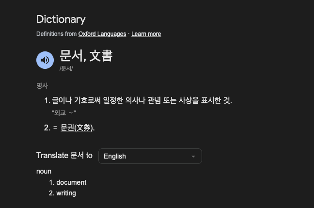

## TL;DR

문서는 가능한 한 많이 쓰는 것이 아니라,  
협업에 필요한 범위까지 정확하게 쓰는 것이 중요하다.  
모든 사람을 만족시키는 문서는 존재하지 않으며,  
목적과 독자에 따라 문서의 깊이와 형태는 달라져야 한다.

---

## 들어가며

요구사항 정의 문서를 작성하다 보면 한 가지 질문에 반복해서 부딪힌다.

`“이 문서를 도대체 어디까지 작성해야 하지?”`

너무 간략하게 작성하면 구현 단계에서 해석이 갈리고,  
너무 상세하게 작성하면 읽히지 않는다.  

가독성과 정확성은 대부분 서로를 희생한다.

특히 여러 역할이 동시에 관여하는 협업 환경에서는  
하나의 문서가 모든 기대를 만족시키기 어렵다.

- 기획자는 정책의 명확성을 원하고  
- 개발자는 구현 가능한 수준의 상세 정보를 원하며  
- QA는 예외와 경계 조건을 확인할 수 있기를 원한다  

모든 요구를 단일 문서에 담으려는 시도는  
결국 문서를 비대하게 만들고, 실제 활용도를 떨어뜨린다.

> 그래서 문서의 목적과 범위를 정확하게 설정하는 것이 중요하다.

---

## 문서의 목적이 범위를 결정한다

분량과 형식보다 먼저 결정해야 할 것은 목적이다.

문서는 정보를 저장하기 위한 것이 아니라,  
협업을 가능하게 만들기 위해 존재한다.

문서의 범위를 결정하기 위해 가장 먼저 답해야 할 질문은 다음과 같다.

`“이 문서를 읽고 누가 어떤 행동을 해야 하는가?”`

이 질문에 답하지 못하면 문서는 쉽게 방향을 잃는다.

- 구현을 위한 문서라면 데이터 구조와 흐름이 중요하고  
- 정책 공유 문서라면 용어 정의와 예외 규칙이 중요하며  
- 온보딩 문서라면 전체 구조와 맥락이 중요하다  

목적이 다르면 필요한 정보도 달라진다.

> 모두를 만족시키는 단일 문서를 만들고 싶다면    
> 그러한 문서가 실제로 존재한 적이 있는지 먼저 되돌아볼 필요가 있다.

---

## 모든 사람을 위한 문서는 존재하지 않는다

현실에서 자주 발생하는 오해 중 하나는  
“모든 사람이 이해할 수 있는 문서가 좋은 문서”라는 믿음이다.

하지만 실제로는 그렇지 않다.

모든 사람을 만족시키기 위해 작성된 문서는

핵심이 흐려진 요약문의 형태로 혼종이 되거나,  
읽기 어려운 장문의 명세서 일 가능성이 높다.

대부분의 경우 문서를 읽는 사람은 다음과 같다.
- 기능을 구현해야 하는 개발자  
- 정책의 모호함을 검증해야 하는 QA  
- 변경 영향도를 판단해야 하는 동료 개발자  

기획 의도 설명, 운영 절차, 교육 목적까지 모두 포함시키면  
문서는 빠르게 복잡해진다.

뭔가 조율이 필요한 시점이다.

> 가독성과 디테일 사이에서 균형을 조율해보면 어떨까?

---

## 가독성과 디테일 사이의 균형

문서 작성에서 가장 어려운 지점은  
가독성과 설계 디테일 사이의 균형이다.

- 가독성을 우선하면 중요한 전제가 생략되고  
- 디테일을 우선하면 문서가 사용되지 않는다  

이 문제를 해결하는 가장 현실적인 방법은  
단일 문서에 모든 정보를 담는 것이 아니라  
문서 간 역할을 분리하는 것이다.

- 요구사항 정의 문서 = 무엇을 해야 하는가  
- 설계 문서 = 어떻게 구현할 것인가  
- ADR = 왜 그렇게 선택했는가  
- 운영 문서 = 장애 시 무엇을 해야 하는가  

각 문서는 자신이 갖는 목적에 집중할 때 가장 유용하다.  

> 그럼, 상황에 맞는 문서를 
---

## 상황에 따라 필요한 문서
“좋은 문서”는 하나의 형태로 정의되지 않는다

업무 환경과 도메인의 특성에 따라  
필요한 문서의 종류와 깊이는 크게 달라진다.

그리고, 필요한 상황에 좋은 문서를 정리하면 다음과 같다.

| 상황 | 효과적인 문서 유형 | 목적 |
|------|------------------|------|
| 시스템 구조를 빠르게 파악해야 하는 경우 | Context / Container / Component Diagram | 외부 관계와 전체 구조 이해 |
| 특정 서비스의 내부 동작을 이해해야 하는 경우 | Component Diagram / Code 수준 설명 | 세부 구현 흐름 파악 |
| 정합성과 예외 처리가 중요한 도메인 | 상태 머신 / LLD / ADR | 상태 전이 규칙과 설계 의도 명확화 |
| 설계 결정의 근거를 공유해야 하는 경우 | ADR | 의사결정의 이유 기록 |
| 협업 전반을 위한 공통 이해가 필요한 경우 | Overall Architecture / HLD | 서비스 구조와 책임 정의 |
| 운영 및 장애 대응이 필요한 경우 | Deployment Diagram / Runbook | 배포 구조 및 대응 절차 공유 |

겉보기에는 상황별로 적절한 문서 형식이 존재하는 것처럼 보이지만  
실제 작성 단계에서는 여전히 어려움이 남는다.

특히 이러한 문서가 조직 내에 축적되어 있지 않은 경우라면  
문서 작성의 부담은 더욱 커진다.

> 실제로 도움이 되었던 문서들의 공통적인 특징이 있지 않나? 

---

## 협업에서 실제로 도움이 되는 문서의 특징

경험상 협업에 도움이 되는 문서는 다음 특징을 가진다.

### 1. 빠르게 맥락을 파악할 수 있다

세부 내용보다 먼저 전체 방향을 이해할 수 있어야 한다.  
읽는 사람이 현재 작업과의 관련성을 즉시 판단할 수 있어야 한다.

### 2. 정책의 모호함이 드러난다

완벽하게 정리된 문서보다  
논의가 필요한 지점을 드러내는 문서가 더 유용하다.  

모호함을 숨기면 구현 단계에서 비용이 발생한다.

### 3. 변경 영향 범위를 추적할 수 있다

어떤 부분이 다른 영역에 영향을 주는지 보이지 않으면  
협업 비용이 급격히 증가한다.

이러한 특징을 갖춘 문서는  
엄격한 형식보다 실용성과 수정 용이성을 우선한 경우가 많았다.

작성자가 부담 없이 업데이트할 수 있었고,  
시간이 지날수록 정보가 축적되며 문서의 가치도 함께 증가했다.

이처럼 지속적으로 보완되고 확장되는 문서를  
흔히 “살아있는 문서”라고 부른다.

> 살아있는 문서란 뭘까?
---

## 살아있는 문서라는 관점

좋은 문서는 처음부터 완성된 문서가 아니라  
필요에 따라 수정되고 확장되는 문서로 자라난다.

요구사항은 시간이 지나면서 변하고,  
정책은 운영 과정에서 구체화된다.

따라서 문서는 결과물이 아니라 과정의 일부에 가깝다.

완벽한 문서를 만드는 것보다  
수정하기 쉬운 구조를 만드는 것이 더 중요하다.

---

## 결론

협업을 위한 요구사항 문서를 작성할 때  
핵심은 분량이 아니라 범위다.

무엇을 얼마나 자세히 쓸 것인가보다  
이 문서가 누구를 위한 것이며  
어떤 행동을 유도해야 하는지를 먼저 정의해야 한다.

다음 질문에 답할 수 있다면 충분하다.

- 누구를 위한 문서인가  
- 어떤 행동을 유도하기 위한 문서인가  
- 다른 문서와 어떤 역할을 분담하는가  

이 기준이 명확해지면  
문서의 깊이와 형식은 자연스럽게 결정된다.

> 좋은 문서는 모든 사람을 만족시키는 문서가 아니라  
> 필요한 사람이 필요한 시점에 실제로 사용할 수 있는 문서다.

