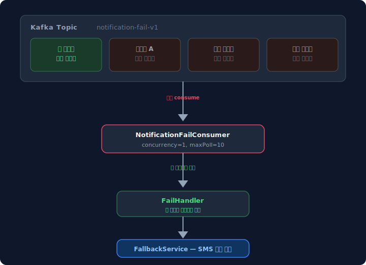
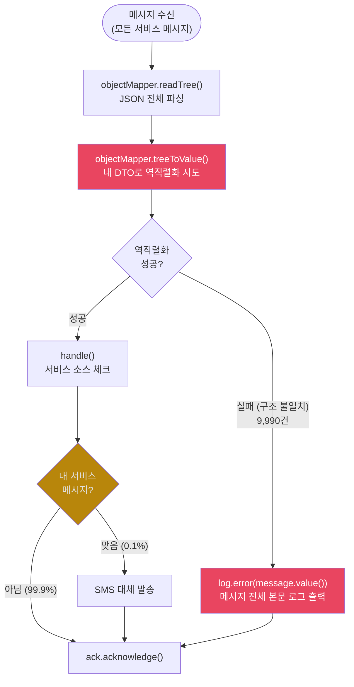
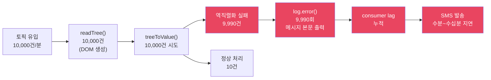
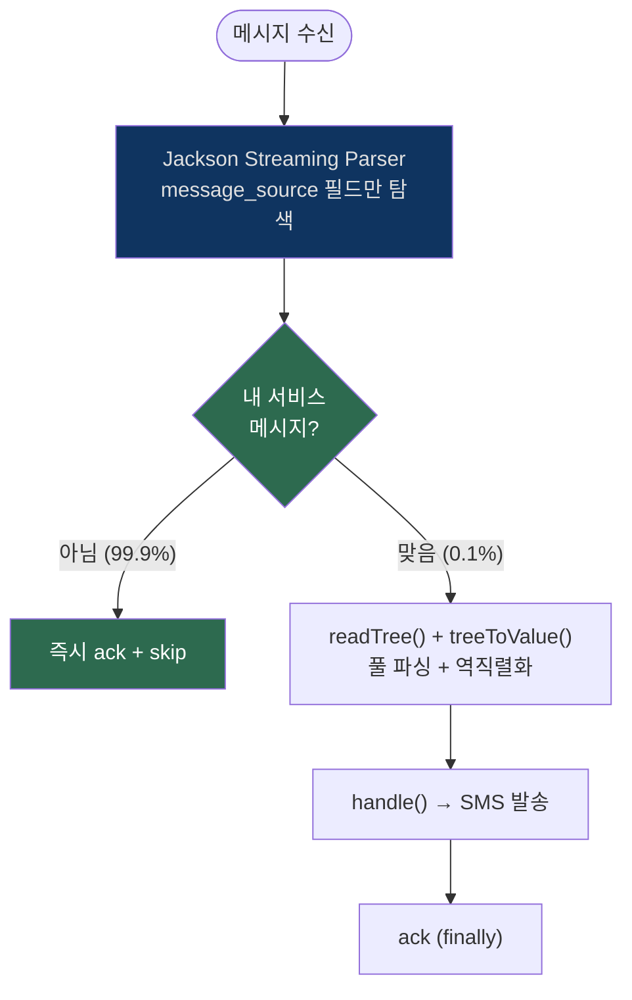
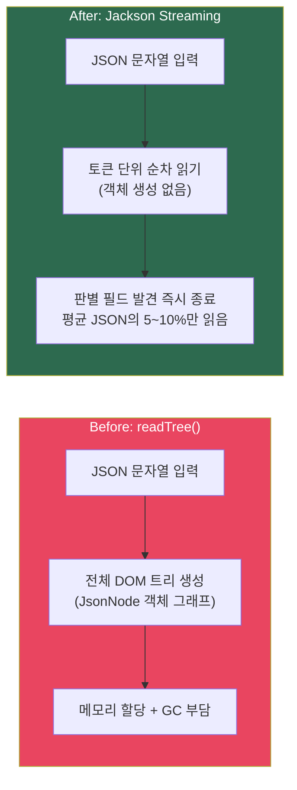
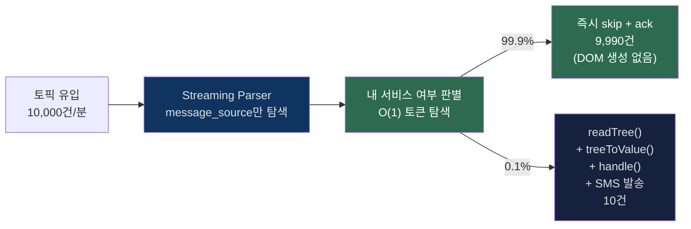
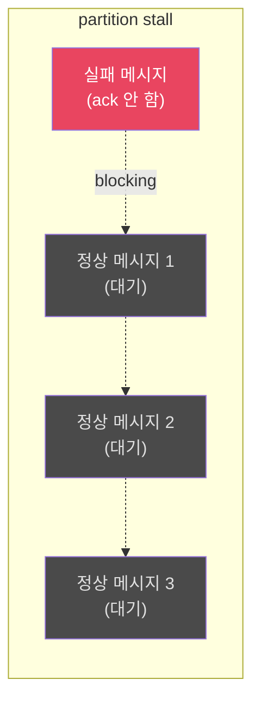

## TL;DR

잘못된 토픽 설계와 불필요한 파싱 때문에, 대부분 "안 봐도 되는 메시지를 너무 정성스럽게 처리해서" 발생한 문제를 겪었습니다.    

전체를 파싱하고, 역직렬화하고, 실패하면 본문째 로그로 찍는 구조인데요,   
트래픽이 올라가면 consumer lag으로 바로 이어집니다.    

이 글에서는 실제로 겪었던 Kafka Consumer 병목 패턴과,  
Jackson Streaming Parser로 사전 필터링한 경험을 다룹니다.    

---

## 들어가며

Kafka 토픽 하나에 여러 서비스 메시지가 섞여 있는 구조는 레거시 혹은 특정 상황에서는 자주 보이는 케이스 입니다.

"알림톡 발송 실패" 토픽이 있다고 치면,   
여기에 온갖 서비스의 실패 메시지가 다 들어왔었습니다.  

필요한 건 특정 실패 메시지뿐인데,
토픽을 쪼갤 수 없는 상황이라면 어떻게 해야 할까요?

근본적으로는 토픽을 도메인 단위로 분리하는 게 맞습니다.
하지만 이 토픽은 producer 쪽에서 "알림톡 실패"라는 하나의 관심사로 설계한 구조였고,  

consumer마다 필요한 메시지가 다르다는 점은 나중에 드러난 문제였습니다.

토픽 분리는 producer를 소유한 다른 팀의 변경이 필요해서 단기적으로는 어려웠고,  
consumer 쪽에서 비용을 줄이는 방향을 먼저 택했습니다.

이 구조에서 consumer를 돌리다 보면 꽤 빨리 성능 문제를 만나게 됩니다.  

---

## 어떤 구조였나



토픽에 분당 10,000건이 들어오는데, 처리할 건 그중 0.1%인 10건 정도입니다.  
나머지 9,990건은 읽고 버려야 하는데요, 이 "읽고 버리는" 과정이 생각보다 무겁습니다.

### 흔한 구현: 일단 다 파싱하고 필터링



왜 느린지 하나씩 뜯어보겠습니다.

### 병목 1: 모든 메시지에 readTree()

`objectMapper.readTree()`는 JSON 문자열을 통째로 파싱해서 `JsonNode` 트리를 메모리에 올립니다.
메시지 하나당 수십~수백 개의 `JsonNode` 객체가 만들어지고, 쓰고 나면 바로 GC 대상이 됩니다.

분당 10,000건이면 분당 수십만 개의 단명 객체가 만들어졌다 사라집니다.

### 병목 2: 전부 역직렬화 시도

`treeToValue()`로 DTO에 매핑을 시도하는데, 다른 서비스 메시지는 구조가 다르니까 대부분 실패합니다.   

9,990건의 역직렬화 실패는 곧 9,990번의 예외 생성 + 스택트레이스 구성을 의미합니다.

예외를 만드는 것 자체가 비쌉니다.

### 병목 3: 실패하면 본문 전체를 로그로

여기가 가장 아팠습니다.
역직렬화 실패하면 디버깅용으로 `log.error(message.value())` 찍는 경우가 많은데, 이게 분당 9,990번 호출됩니다.
본문이 1KB라고 치면 분당 약 10MB 로그가 쌓입니다.  

로그 I/O가 consumer 스레드를 잡아먹고, 로그 백엔드(Elasticsearch 등)에도 부하를 줍니다.

거기다 본문에 전화번호, 이름 같은 **개인정보**가 들어있다면 로그 시스템에 민감정보가 그대로 쌓이게 됩니다.

### 트래픽이 늘면 어떻게 되나요?



10건 처리하려고 10,000건을 풀 파싱하고, 9,990번 예외 만들고, 9,990번 로그 찍는 구조입니다.  

lag은 쌓이고, 정작 중요한 SMS 대체 발송은 몇 분씩 밀립니다.

---

## 어떻게 해결했나 ? - Jackson Streaming으로 사전 필터링

선택지는 크게 두 가지였습니다.  

토픽을 분리해서 구조 자체를 바꾸거나, consumer에서 필터링 비용을 줄이거나.  

토픽 분리는 producer 팀과의 협의 + 메시지 마이그레이션이 필요해서 최소 몇 주가 걸리는 일이었고,

당장 consumer lag이 쌓이고 있는 상황에서는 consumer 쪽에서 먼저 손을 대야 했습니다.

아이디어 자체는 간단합니다.

> **"내 메시지가 아니면 readTree()를 아예 안 부른다."**

JSON에서 `message_source` 필드 하나만 빠르게 읽으면 되는데,   
그걸 위해 전체 DOM 트리를 만들 이유가 없습니다.

Jackson의 **Streaming API (JsonParser)** 는 토큰 단위로 JSON을 순차 읽기하기 때문에, 객체를 안 만들고 원하는 필드 찾으면 바로 끊을 수 있습니다.

### 변경 후에는 어떤 흐름이 되나요?



핵심은 **99.9%가 Streaming 단계에서 끝난다**는 점입니다.
나머지 0.1%만 풀 파싱을 거칩니다.

에러 처리와 ack 보장 전략은 [아래 섹션](#왜-실패해도-ack을-하나요)에서 다룹니다.

### Streaming과 readTree, 뭐가 다른 건가요?



| 지표 | readTree() | Streaming |
|------|-----------|-----------|
| 메모리 할당 | JsonNode 트리 전체 | 거의 없음 (토큰 버퍼만) |
| CPU | 전체 JSON 파싱 | 판별 필드까지만 |
| GC 부담 | 높음 (단명 객체 대량 생성) | 최소 |
| 관심 없는 메시지 비용 | **readTree 전체 비용** | **5~10% 비용** |

### 성능은 얼마나 달라졌나요?



| 지표 | Before | After | 개선율 |
|------|--------|-------|--------|
| JSON DOM 파싱 (readTree) | 10,000건 | 10건 | **99.9% 감소** |
| 역직렬화 시도 (treeToValue) | 10,000건 | 10건 | **99.9% 감소** |
| 관심 없는 메시지 파싱 비용 | readTree 전체 | Streaming 5~10% | **~95% 감소** |
| log 호출 (본문 포함) | 9,990건 | 0건 | **100% 제거** |
| 로그 I/O | 9,990회 (본문 포함) | 실패 시에만 (메타만) | **99.9%+ 감소** |
| 민감정보 노출 | 9,990건 | 0건 | **100% 제거** |
| consumer lag | 누적 (수분~수십분) | 최소 | **즉시 처리** |

---

## 구현

### Streaming 사전 필터

```kotlin
private val jsonFactory = objectMapper.factory

private fun isMyMessage(payload: String): Boolean {
    if (payload.isEmpty()) return false
    return runCatching {
        jsonFactory.createParser(payload).use { parser ->
            while (parser.nextToken() != null) {
                if (parser.currentToken == JsonToken.FIELD_NAME
                    && parser.currentName == "message_source"
                ) {
                    parser.nextToken()
                    return@runCatching parser.valueAsString == "my-service"
                }
            }
            false
        }
    }.getOrElse { false }
}
```

`jsonFactory.createParser()`로 Streaming Parser를 열고, 토큰을 하나씩 읽다가 `message_source`를 만나면 값만 확인하고 바로 끊습니다.
DOM 트리를 안 만드니까 메모리 할당이 거의 없습니다.

### Consumer 본체

```kotlin
fun listen(message: ConsumerRecord<String, String>, ack: Acknowledgment) {
    // 1. Streaming으로 내 메시지인지 확인 — 아니면 즉시 skip
    if (!isMyMessage(message.value())) {
        ack.acknowledge()
        return
    }

    // 2. 내 메시지만 풀 파싱 + 처리 — finally로 ack 보장
    try {
        val root = objectMapper.readTree(message.value())
        val data = objectMapper.treeToValue(root, MyDto::class.java)
        handler.handle(data)
    } catch (e: Exception) {
        log.error(
            "handle_error : topic={} partition={} offset={} key={} cause={}",
            message.topic(), message.partition(), message.offset(),
            message.key() ?: "unknown",
            classifyCause(e), e,
        )
    } finally {
        ack.acknowledge()
    }
}
```

---

## 왜 실패해도 ack을 하나요?

"처리 실패했으면 ack 안 하고 재시도해야 하는 거 아냐?" 라고 생각할 수 있는데요.

맞는 말이지만, **보조 흐름(fallback)** 성격의 consumer라면 실패해도 ack 하는 게 나을 때가 많습니다.

### ack 안 하면 어떻게 되나요?

`MANUAL_IMMEDIATE` + `concurrency=1` 구조에서 ack을 안 하면 이런 일이 벌어집니다.

1. 같은 메시지를 **무한 재시도**합니다. 외부 API 장애면 끝없이 반복됩니다.
2. 해당 partition의 **후속 메시지 전부 blocking**됩니다. partition stall입니다.
3. 뒤에 있는 멀쩡한 메시지들도 처리 못하게 되면서 **장애가 번집니다.**



실패 한 건 때문에 뒤에 있는 수십~수백 건이 다 밀리게 됩니다.
실패를 유실하는 것보다 이게 더 위험합니다.

### ack 보장 패턴: try/finally

```kotlin
// early return 분기: 직접 ack 후 return
if (!isMyMessage(message.value())) {
    ack.acknowledge()
    return
}

// 처리 구간: finally로 ack 보장
try {
    // 역직렬화 + 핸들러 호출
} catch (e: Exception) {
    // 상관키 로깅 (본문은 절대 안 남김)
} finally {
    ack.acknowledge()  // 어떤 경우에도 ack
}
```

`runCatching` + `onFailure`로도 되긴 하는데,   
나중에 누가 중간에 return을 하나 넣으면 ack이 빠질 수 있습니다.  

`try/finally`는 언어가 보장해주니까 그런 실수가 원천 차단됩니다.

### 케이스별 정리

| 케이스 | ack | 로그 | 이유 |
|--------|-----|------|------|
| Streaming 파싱 실패 | O | `warn` (size만) | 재시도해봤자 의미 없습니다 (깨진 메시지) |
| 관심 없는 메시지 | O | 없음 | 내 관심사가 아닙니다 |
| 처리 성공 | O | `info` | 정상입니다 |
| 처리 실패 | **O (finally)** | `error` (상관키+cause) | partition stall 방지 |

---

## 실패 로그 설계: 본문 대신 상관키

실패했을 때 "뭐가 실패했는지" 추적하려면 로그가 필요합니다.  

근데 본문 전체를 찍으면 민감정보 문제가 생기기 때문에,   
대신 **상관키(correlation key)** 와 **실패 원인 분류(cause)** 만 남기도록 했습니다.

```
handle_error :
    topic={}  partition={}  offset={}    -- Kafka 좌표 (정확한 위치)
    key={}                                -- 메시지 키 (대체 상관키)
    userId={}                             -- 비즈니스 상관키
    templateCode={}                       -- 분류용
    cause={}                              -- 실패 원인
```

### cause 분류

예외의 cause chain을 타고 내려가면서 분류합니다.

```kotlin
private fun classifyCause(e: Exception): String {
    val causes = generateSequence<Throwable>(e) { it.cause }.toList()
    return when {
        causes.any { it is JsonProcessingException } -> "DESERIALIZE_FAIL"
        causes.any { it is DataAccessException } -> "DB_FAIL"
        causes.any { it is RestClientException } -> "EXTERNAL_API_FAIL"
        else -> e.javaClass.simpleName
    }
}
```

| cause | 의미 | 대응 |
|-------|------|------|
| `DESERIALIZE_FAIL` | 메시지 구조가 바뀜 | 프로듀서 쪽 변경 이력 확인 |
| `DB_FAIL` | DB 장애 | DB 상태 확인 후 수동 재발송 |
| `EXTERNAL_API_FAIL` | 외부 API 장애 | API 상태 확인 후 수동 재발송 |
| `{클래스명}` | 미분류 | 클래스명으로 역추적 |

상관키가 null일 수도 있습니다(역직렬화 실패 시).
이때는 `message.key()`로 대체해서 **검색 가능한 키가 최소 하나**는 남도록 했습니다.

---

## 이중 파싱은 괜찮은 건가요?

현재 구조에서 내 메시지(0.1%)는 Streaming 스캔 후 readTree로 **2번 파싱**됩니다.

근데 나머지 99.9%에서 readTree를 완전히 날린 이득이 워낙 크기 때문에,   
이 비율에서는 충분히 남는 장사입니다.

다만 내 메시지 비율이 확 올라가는 상황(예: 외부 서비스 전체 장애로 실패가 폭증)에서는 이중 파싱 비용이 눈에 띌 수 있습니다.

> 내 메시지 비율이 10%를 넘기면 streaming 없이 바로 readTree 후 필드 체크 방식으로 전환을 고려해야 합니다.
> 이 경우에도 역직렬화(`treeToValue`)는 내 메시지만 하니까 변경 전보다는 낫습니다.

---

## 이것으로도 안 되면 어떻게 하나요?

이걸로도 못 버틸 만큼 트래픽이 치솟으면 다음을 검토해야 합니다.

| 방안 | 설명 | 난이도 |
|------|------|--------|
| **concurrency 증가** | 병렬 처리 | 낮음 |
| **MAX_POLL_RECORDS 증가** | 한 번에 더 많이 poll | 낮음 |
| **문자열 사전 필터** | Streaming 전에 `contains("\"message_source\":\"my-service\"")` | 중간 (JSON 변형에 취약) |
| **전용 토픽 분리** | 프로듀서 측에 전용 토픽 publish 요청 | 높음 (타팀 협의) |
| **DLQ 도입** | 실패 메시지를 별도 토픽으로 | 중간 |

### DLQ가 필요해지는 시점

- 메시지 유실이 CS나 법적 이슈로 번질 수 있을 때
- 장애가 반복돼서 수동 대응이 지칠 때
- 실패 디버깅에 원문 payload가 꼭 필요할 때 (로그에는 민감정보를 못 남기니까요)
- 발송이 법적 의무(고지 문자 등)로 승격될 때, ack-on-failure가 위험해지면서 DLQ + 재처리 파이프라인이 필수가 됩니다

궁극적으로 가장 깔끔한 건 **전용 토픽 분리**입니다.
내 메시지만 들어오는 토픽이 있으면 사전 필터링 자체가 필요 없습니다.
근데 이건 프로듀서 쪽(다른 팀)이 바꿔줘야 하니까 협의 비용이 큽니다.
현실적으로는 Streaming 필터링이 가성비가 제일 좋았습니다.

---

## 정리

**안 볼 메시지에 비용 쓰지 않는 것**이 가장 중요했습니다.

Jackson Streaming으로 판별 필드만 읽고 바로 skip하도록 바꿨고,   
로그에는 본문 대신 상관키와 cause만 남기도록 했습니다.

보조 흐름이면 실패해도 ack을 해야 하는데요,   
partition stall은 실패 한 건보다 훨씬 큰 장애를 만들기 때문입니다.

모든 경로에서 ack을 보장하기 위해 `try/finally`를 사용했고,   
상관키는 null 방어를 해서 검색 가능한 키가 최소 하나는 남도록 했습니다.

빠르게 처리하는 게 아니라, **안 해도 되는 걸 안 하는 게** 이번 개선의 핵심이었습니다.

다만 이건 consumer 쪽의 대응이고, 구조 자체의 문제는 남아 있습니다.
하나의 토픽에 여러 서비스 메시지가 섞이는 구조는 producer 편의로 만들어진 것이고,
그 비용을 consumer가 떠안는 형태입니다.
장기적으로는 도메인 단위 토픽 분리가 맞고, 이 개선은 그때까지의 버팀목입니다.
