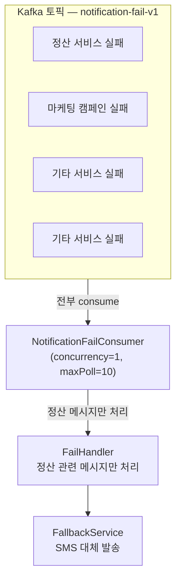
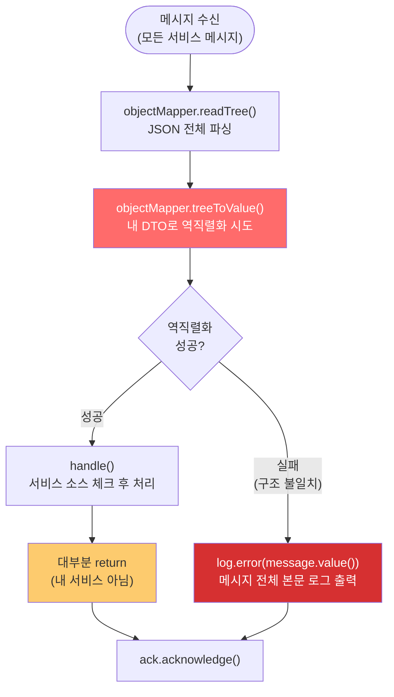
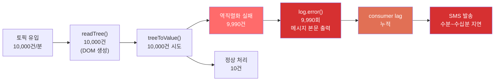
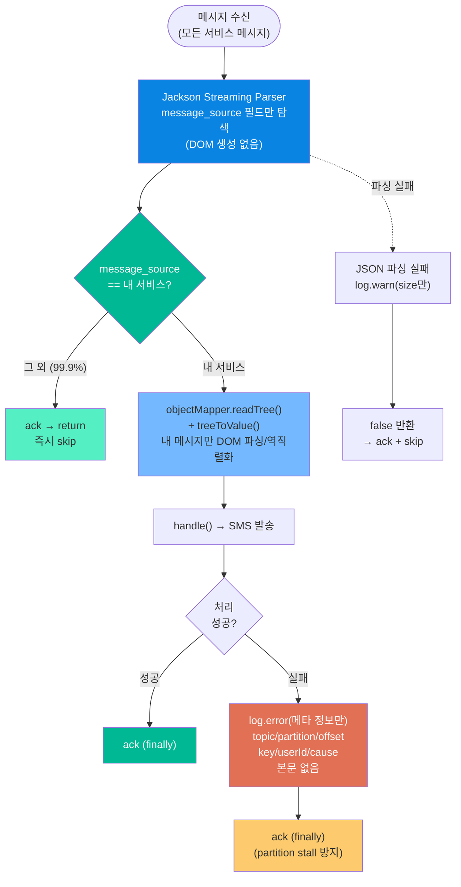
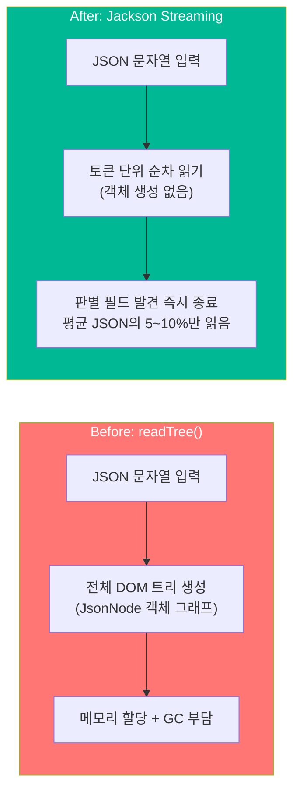
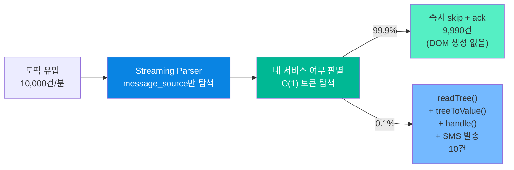
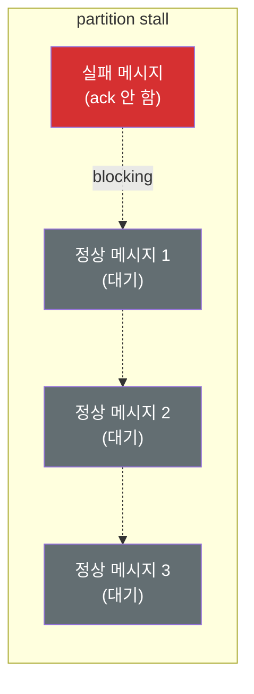
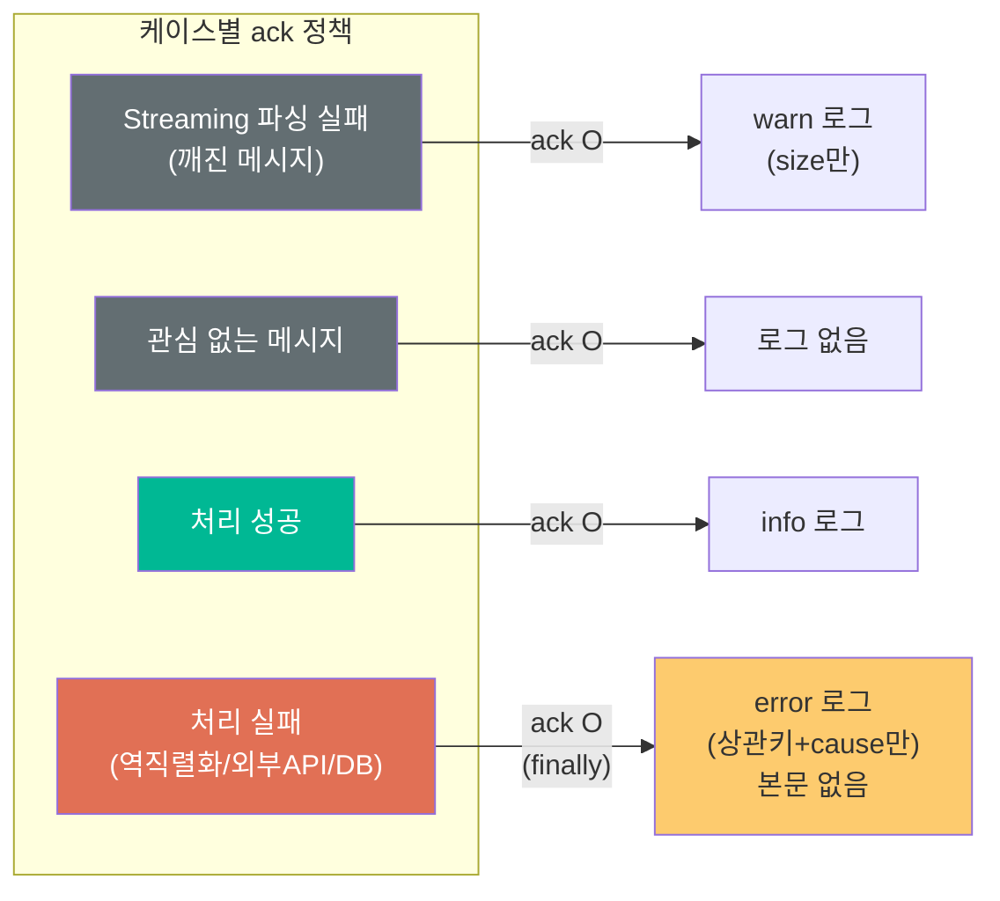

## TL;DR

Kafka Consumer가 느려지는 원인은 대부분 "관심 없는 메시지를 너무 열심히 처리하기 때문"이다.
전체 메시지를 파싱하고, 역직렬화하고, 실패하면 본문 전체를 로그로 남기는 구조는 트래픽이 늘어나면 consumer lag으로 직결된다.
이 글에서는 실제로 마주칠 수 있는 Kafka Consumer 성능 병목 패턴과, Jackson Streaming Parser를 활용한 사전 필터링 전략을 정리한다.

---

## 들어가며

Kafka 토픽 하나에 여러 서비스의 메시지가 섞여 있는 구조는 꽤 흔하다.
예를 들어 "알림톡 발송 실패" 토픽이 있다고 치자. 이 토픽에는 결제 서비스, 마케팅 서비스, 정산 서비스 등 다양한 서비스의 실패 메시지가 들어온다.
내가 관심 있는 건 그중 정산 서비스의 실패 메시지뿐인데, 토픽 자체를 분리할 수 없는 상황이라면?

이런 환경에서 consumer를 운영하다 보면 생각보다 빠르게 성능 문제를 만나게 된다.

---

## 문제 상황

### 구조



토픽에 분당 10,000건의 메시지가 들어오는데, 내가 처리해야 할 메시지는 그중 0.1%인 10건 정도다.
나머지 9,990건은 읽고 버려야 한다.

문제는 "읽고 버리는" 과정이 생각보다 무겁다는 것이다.

### 흔한 구현: 일단 다 파싱하고 필터링



이 구조가 왜 느린지 하나씩 뜯어보자.

### 병목 1: 모든 메시지에 readTree()

`objectMapper.readTree()`는 JSON 문자열을 파싱해서 `JsonNode` 트리(DOM 구조)를 메모리에 만든다.
메시지 하나당 수십~수백 개의 `JsonNode` 객체가 생성되고, 처리 후 바로 GC 대상이 된다.

분당 10,000건이면 분당 수십만 개의 단명 객체가 생성되고 소멸된다.

### 병목 2: 전부 역직렬화 시도

`treeToValue()`로 내 DTO에 매핑을 시도하는데, 다른 서비스의 메시지는 구조가 다르니까 대부분 실패한다.
9,990건의 역직렬화 실패 = 9,990번의 예외 생성 + 스택트레이스 구성. 예외 생성 자체가 비싸다.

### 병목 3: 실패하면 메시지 본문 전체를 로그로

여기가 진짜 무섭다. 역직렬화에 실패하면 디버깅용으로 `log.error(message.value())`를 찍는 경우가 많은데, 이게 분당 9,990번 호출된다.
메시지 본문이 1KB라고 치면 분당 약 10MB의 로그가 쌓인다. 로그 I/O가 consumer 스레드를 blocking하고, 로그 백엔드(Elasticsearch 등)에도 부하를 준다.

거기다 메시지 본문에 전화번호, 이름 같은 **개인정보가 포함**되어 있다면? 로그 시스템에 민감정보가 그대로 적재된다.

### 트래픽이 늘면 벌어지는 일



10건을 처리하기 위해 10,000건을 풀 파싱하고, 9,990번 예외를 만들고, 9,990번 로그를 찍는 구조다.
consumer lag은 쌓이고, 정작 중요한 SMS 대체 발송은 수분~수십분 지연된다.

---

## 해결: Jackson Streaming으로 사전 필터링

핵심 아이디어는 단순하다.

> **"내 메시지가 아니면 readTree() 자체를 호출하지 않는다."**

JSON에서 `message_source` 같은 판별 필드 하나만 빠르게 읽으면 되는데, 그걸 위해 전체 DOM 트리를 만들 필요가 없다.
Jackson의 **Streaming API (JsonParser)** 는 토큰 단위로 JSON을 순차 읽기한다. 객체를 생성하지 않고, 원하는 필드를 찾으면 즉시 멈출 수 있다.

### 변경 후 흐름



### Streaming vs readTree 비교



| 지표 | readTree() | Streaming |
|------|-----------|-----------|
| 메모리 할당 | JsonNode 트리 전체 | 거의 없음 (토큰 버퍼만) |
| CPU | 전체 JSON 파싱 | 판별 필드까지만 |
| GC 부담 | 높음 (단명 객체 대량 생성) | 최소 |
| 관심 없는 메시지 비용 | **readTree 전체 비용** | **5~10% 비용** |

### 성능 개선 효과



| 지표 | Before | After | 개선율 |
|------|--------|-------|--------|
| JSON DOM 파싱 (readTree) | 10,000건 | 10건 | **99.9% 감소** |
| 역직렬화 시도 (treeToValue) | 10,000건 | 10건 | **99.9% 감소** |
| 관심 없는 메시지 파싱 비용 | readTree 전체 | Streaming 5~10% | **~95% 감소** |
| log 호출 (본문 포함) | 9,990건 | 0건 | **100% 제거** |
| 로그 I/O | 9,990회 (본문 포함) | 실패 시에만 (메타만) | **99.9%+ 감소** |
| 민감정보 노출 | 9,990건 | 0건 | **100% 제거** |
| consumer lag | 누적 (수분~수십분) | 최소 | **즉시 처리** |

---

## 구현

### Streaming 사전 필터

```kotlin
private val jsonFactory = objectMapper.factory

private fun isMyMessage(payload: String): Boolean {
    if (payload.isEmpty()) return false
    return runCatching {
        jsonFactory.createParser(payload).use { parser ->
            while (parser.nextToken() != null) {
                if (parser.currentToken == JsonToken.FIELD_NAME
                    && parser.currentName == "message_source"
                ) {
                    parser.nextToken()
                    return@runCatching parser.valueAsString == "my-service"
                }
            }
            false
        }
    }.getOrElse { false }
}
```

`jsonFactory.createParser()`로 Streaming Parser를 열고, 토큰을 하나씩 읽다가 `message_source` 필드를 만나면 값을 확인하고 즉시 종료한다.
DOM 트리를 만들지 않으므로 메모리 할당이 거의 없다.

### Consumer 본체

```kotlin
fun listen(message: ConsumerRecord<String, String>, ack: Acknowledgment) {
    // 1. Streaming으로 내 메시지인지 확인 — 아니면 즉시 skip
    if (!isMyMessage(message.value())) {
        ack.acknowledge()
        return
    }

    // 2. 내 메시지만 풀 파싱 + 처리 — finally로 ack 보장
    try {
        val root = objectMapper.readTree(message.value())
        val data = objectMapper.treeToValue(root, MyDto::class.java)
        handler.handle(data)
    } catch (e: Exception) {
        log.error(
            "handle_error : topic={} partition={} offset={} key={} cause={}",
            message.topic(), message.partition(), message.offset(),
            message.key() ?: "unknown",
            classifyCause(e), e,
        )
    } finally {
        ack.acknowledge()
    }
}
```

---

## Ack 정책: 왜 실패해도 ack 하는가

여기서 "처리 실패하면 ack 안 하고 재시도해야 하는 거 아닌가?" 라는 의문이 들 수 있다.

상황에 따라 다르지만, **보조 흐름(fallback)** 성격의 consumer라면 실패해도 ack 하는 게 맞는 경우가 많다.

### ack 안 하면 벌어지는 일

`MANUAL_IMMEDIATE` + `concurrency=1` 구조에서 ack을 안 하면:
1. 같은 메시지를 **무한 재시도** — 외부 API가 장애 상태면 영원히 반복
2. 해당 partition의 **모든 후속 메시지가 blocking** — partition stall
3. 뒤에 있는 정상 메시지들도 처리 못함 → **장애 확산**



한 건의 실패 때문에 수십~수백 건의 정상 메시지가 지연되는 건, 실패를 유실하는 것보다 더 나쁜 결과를 만든다.

### ack 보장 패턴: try/finally

```kotlin
// early return 분기: 직접 ack 후 return
if (!isMyMessage(message.value())) {
    ack.acknowledge()
    return
}

// 처리 구간: finally로 ack 보장
try {
    // 역직렬화 + 핸들러 호출
} catch (e: Exception) {
    // 상관키 로깅 (본문은 절대 안 남김)
} finally {
    ack.acknowledge()  // 어떤 경우에도 ack
}
```

`runCatching` + `onFailure` 패턴도 가능하지만, 유지보수 시 누군가 중간에 return을 넣으면 ack이 누락될 수 있다.
`try/finally`는 언어 수준에서 보장하므로 미래의 실수를 방지한다.

### 케이스별 정리



| 케이스 | ack | 로그 | 이유 |
|--------|-----|------|------|
| Streaming 파싱 실패 | O | `warn` (size만) | 재시도 무의미 (깨진 메시지) |
| 관심 없는 메시지 | O | 없음 | 관심 대상 아님 |
| 처리 성공 | O | `info` | 정상 |
| 처리 실패 | **O (finally)** | `error` (상관키+cause) | partition stall 방지 |

---

## 실패 로그 설계: 본문 대신 상관키

실패했을 때 "무엇이 실패했는지"를 추적하려면 로그가 필요하다.
하지만 메시지 본문 전체를 남기면 민감정보 문제가 생긴다. 대신 **상관키(correlation key)** 와 **실패 원인 분류(cause)** 만 남긴다.

```
handle_error :
    topic={}  partition={}  offset={}    ← Kafka 좌표 (정확한 위치)
    key={}                                ← 메시지 키 (대체 상관키)
    userId={}                             ← 비즈니스 상관키
    templateCode={}                       ← 분류용
    cause={}                              ← 실패 원인
```

### cause 분류

예외를 cause chain으로 탐색해서 분류한다.

```kotlin
private fun classifyCause(e: Exception): String {
    val causes = generateSequence<Throwable>(e) { it.cause }.toList()
    return when {
        causes.any { it is JsonProcessingException } -> "DESERIALIZE_FAIL"
        causes.any { it is DataAccessException } -> "DB_FAIL"
        causes.any { it is RestClientException } -> "EXTERNAL_API_FAIL"
        else -> e.javaClass.simpleName
    }
}
```

| cause | 의미 | 대응 |
|-------|------|------|
| `DESERIALIZE_FAIL` | 메시지 구조가 변경됨 | 프로듀서 측 변경 이력 확인 |
| `DB_FAIL` | DB 장애 | DB 상태 확인, 복구 후 수동 재발송 |
| `EXTERNAL_API_FAIL` | 외부 API 장애 | API 상태 확인, 복구 후 수동 재발송 |
| `{클래스명}` | 미분류 | 클래스명으로 역추적 |

상관키가 null일 수도 있다(역직렬화 실패 시). 이때는 `message.key()`로 대체해서 **검색 가능한 키가 반드시 하나 이상** 남도록 보장한다.

---

## 이중 파싱 트레이드오프

현재 구조는 내 메시지(0.1%)에 대해 Streaming 스캔 → readTree 전체 파싱으로 **2번 파싱**한다.
관심 없는 99.9%에서 readTree를 완전히 제거한 이득이 압도적이므로 현 비율에서는 최적이다.

하지만 내 메시지 비율이 급증하는 상황(예: 외부 서비스 전체 장애로 실패가 폭증)에서는 이중 파싱 비용이 증가할 수 있다.

> 내 메시지 비율이 10%를 넘어가면 streaming 사전 필터 없이 곧바로 readTree → 필드 체크 방식으로 전환을 검토한다.
> 이 경우 관심 없는 메시지에서도 DOM 생성이 발생하지만, 역직렬화(`treeToValue`)는 여전히 내 메시지만 하므로 변경 전 구조보다는 낫다.

---

## 더 극단적인 상황이 오면

현재 변경으로도 충분하지 않을 만큼 트래픽이 폭증하면:

| 방안 | 설명 | 난이도 |
|------|------|--------|
| **concurrency 증가** | 병렬 처리 | 낮음 |
| **MAX_POLL_RECORDS 증가** | 한 번에 더 많이 poll | 낮음 |
| **문자열 사전 필터** | Streaming 전에 `contains("\"message_source\":\"my-service\"")` | 중간 (JSON 변형에 취약) |
| **전용 토픽 분리** | 프로듀서 측에 전용 토픽 publish 요청 | 높음 (타팀 협의) |
| **DLQ 도입** | 실패 메시지를 별도 토픽으로 전송 | 중간 |

### DLQ가 필요해지는 시점

- 메시지 유실이 CS/정산/법적 이슈로 번질 수 있을 때
- 장애가 반복되어 수동 대응이 피로해질 때
- 실패 디버깅에 원문 payload가 꼭 필요할 때 (로그에는 민감정보를 못 남기니까)
- 발송이 법적 의무(고지 문자 등)로 승격될 때 → ack-on-failure가 위험해지며, DLQ + 재처리 파이프라인이 필수

가장 건강한 최종 해결책은 **전용 토픽 분리**다. 내 메시지만 들어오는 토픽이 있으면 사전 필터링 자체가 필요 없어진다.
하지만 이건 프로듀서 측(타 팀)의 변경이 필요하므로 협의 비용이 크다. 현실적으로는 Streaming 필터링이 비용 대비 효과가 가장 좋다.

---

## 정리

1. **관심 없는 메시지에 비용을 쓰지 마라** — Jackson Streaming으로 판별 필드만 읽고 즉시 skip
2. **로그에 메시지 본문을 남기지 마라** — 민감정보 노출 + I/O 병목. 상관키와 cause만 남겨라
3. **보조 흐름이면 실패해도 ack 해라** — partition stall은 실패 하나보다 훨씬 큰 장애를 만든다
4. **모든 경로에서 ack을 보장해라** — `try/finally`로. `runCatching`은 중간 return에 취약하다
5. **상관키는 null 방어를 해라** — 검색 가능한 키가 최소 하나는 남아야 운영에서 추적할 수 있다

성능 최적화의 핵심은 "더 빠르게 처리하는 것"이 아니라 **"불필요한 처리를 하지 않는 것"** 이다.
