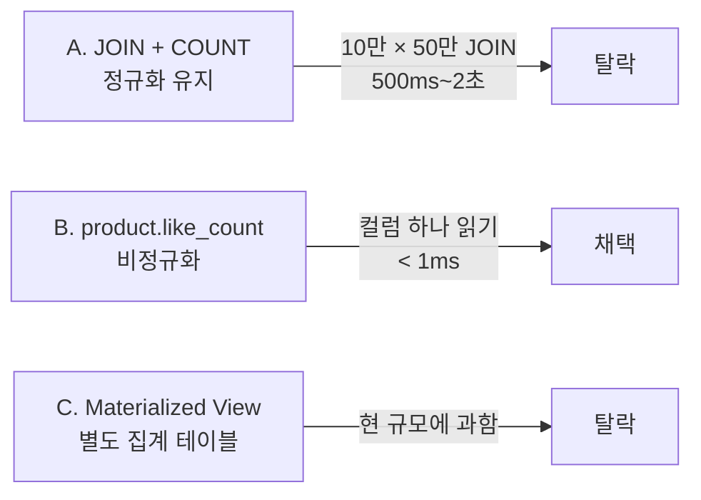
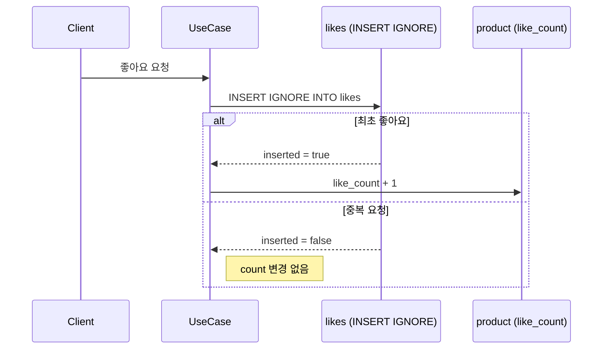
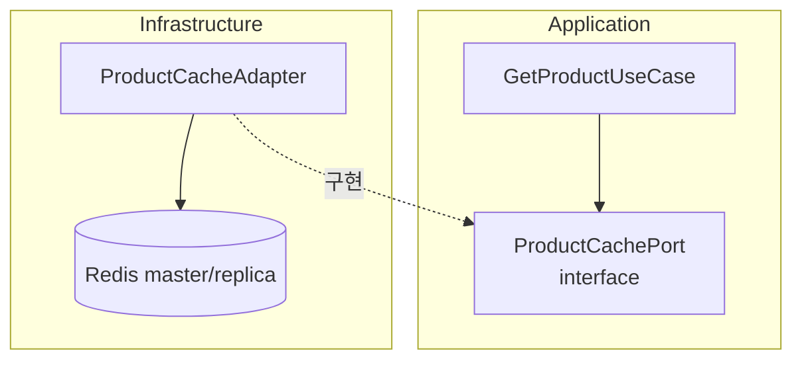
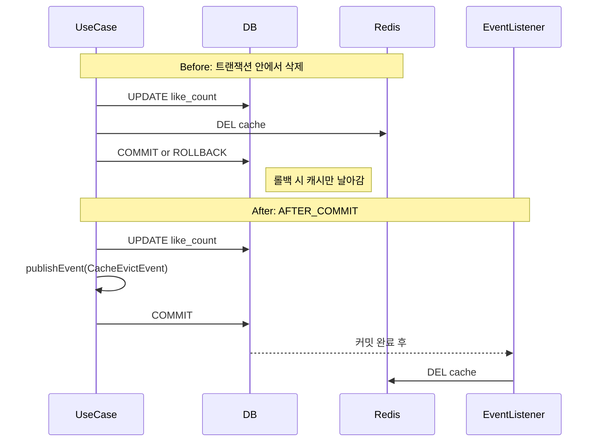
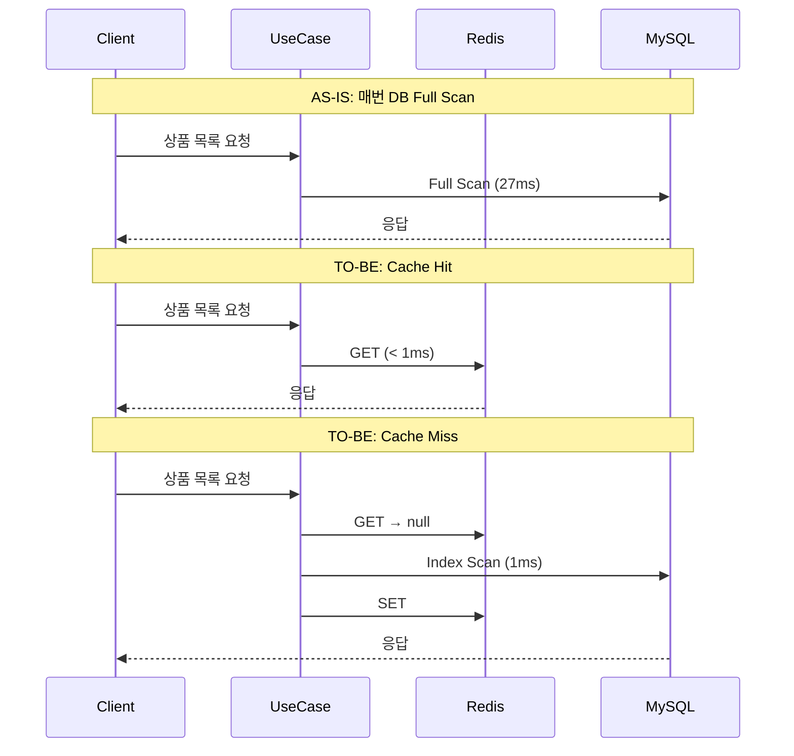

## 들어가며
Round5 과제는 세 가지였다.

1. 상품 목록 조회에 인덱스 최적화
2. 좋아요 수 정렬 구조 개선
3. Redis 캐시 적용

10만 건 데이터를 준비하고, EXPLAIN 분석하고, 전후 비교하라는 것.

> 세 가지를 각각 독립적으로 구현하면 되는 줄 알았다.
> 근데 하다 보니, 이게 순서가 있었다.
>
> 비정규화로 `like_count` 컬럼을 확보해야 인덱스를 걸 수 있고,
> 인덱스가 잡혀야 cache miss가 발생해도 부담이 없고,
> 그 위에 캐시를 얹어야 의미가 있다.
>
> 캐시부터 붙이면? 인덱스 없는 쿼리를 가리는 붕대가 된다.

---

## EXPLAIN이 보여준 현실

설계 문서(`04-erd.md`)에는 인덱스가 정의되어 있었다.
근데 `ProductEntity.kt`에는 `@Index`가 없었다.
`ddl-auto: create` 환경이니까, Entity에 없으면 DB에도 없는 거다.

EXPLAIN을 찍어보면 바로 보인다.

```
type: ALL
key: NULL
rows: 99203
Extra: Using where; Using filesort
```

10만 행 풀스캔, 메모리 정렬. 실측 27ms.

```mermaid
xychart-beta
    title "인덱스 적용 전후 스캔 행 수 (10만 건)"
    x-axis ["브랜드+최신순", "브랜드+인기순", "브랜드+가격순", "전체 인기순"]
    y-axis "rows" 0 --> 100000
    bar [99203, 99203, 99203, 99203]
    bar [2000, 2000, 2000, 99203]
```



인덱스 적용 후:

```
type: ref
key: idx_product_brand_like_count
rows: 2000
Extra: Using where; Backward index scan
```

27ms → 1ms. 96% 개선. `Using filesort`도 사라졌다.

---

## 인덱스를 3개만 만든 이유

쿼리 패턴은 6개다. 브랜드 필터 유무 × 정렬 3종류.
인덱스도 6개 만들 수 있었다.

3개만 만들었다. 브랜드별 조회용으로만.

```kotlin
@Table(
    name = "product",
    indexes = [
        Index(name = "idx_product_brand_created", columnList = "brand_id, created_at"),
        Index(name = "idx_product_brand_like_count", columnList = "brand_id, like_count"),
        Index(name = "idx_product_brand_price", columnList = "brand_id, price"),
    ],
)
```

전체 조회(브랜드 미지정)는 빈도가 낮다. 이쪽은 TTL 5분 캐시로 커버한다.
인덱스 하나 추가할 때마다 INSERT/UPDATE에서 B-Tree 갱신 비용이 붙으니까,
안 쓰는 인덱스를 미리 만들어두는 건 쓰기 성능을 공짜로 깎는 거다.

`deleted_at`을 인덱스에 넣을까도 생각했다.
`(brand_id, deleted_at, like_count)` 3컬럼으로.
근데 소프트 딜리트 특성상 `deleted_at IS NULL`은 전체 행의 95% 이상이 해당된다.
카디널리티가 낮은 컬럼은 인덱스에 넣어도 B-Tree에서 걸러지는 게 거의 없다.
`brand_id`로 좁힌 다음 행 수준에서 필터하는 게 낫다.

| 쿼리 | AS-IS | TO-BE | filesort |
|------|-------|-------|----------|
| 브랜드+최신순 | ALL / 99,203 rows | ref / 2,000 rows | 제거됨 |
| 브랜드+인기순 | ALL / 99,203 rows | ref / 2,000 rows | 제거됨 |
| 브랜드+가격순 | ALL / 99,203 rows | ref / 2,000 rows | 제거됨 |
| 전체 인기순 | ALL / 99,203 rows | ALL / 99,203 rows | 유지 (캐시로 커버) |

전체 인기순은 선두 컬럼 `brand_id`를 안 쓰니까 인덱스 효과가 없다.
이건 해결이 아니라 유예다. 트래픽이 늘면 `like_count` 단일 인덱스를 추가하든 다른 방법이 필요하다.

---

## 좋아요 수 비정규화: 선택지와 판단

좋아요 수로 정렬하려면, 그 값이 어딘가에 있어야 한다.
선택지는 세 개였다.



B를 선택한 건, 읽기 성능도 있지만 동기화 전략이 단순하기 때문이다.

원자적 UPDATE + INSERT IGNORE 조합으로 동시성과 멱등성을 동시에 잡는다.

```sql
UPDATE product SET like_count = like_count + 1 WHERE id = ?
UPDATE product SET like_count = like_count - 1 WHERE id = ? AND like_count > 0
```



INSERT가 성공했을 때만 count를 올린다.
중복 방지를 애플리케이션 `if`문이 아니라 DB unique constraint가 보장한다.
하나의 트랜잭션 안에서 INSERT → UPDATE가 일어나니까, 중간에 깨질 수 없다.

비정규화가 "정합성을 포기하는 것"이라고 흔히 말하는데,
동기화 전략이 있으면 그건 **읽기 비용을 쓰기 시점에 미리 지불하는 것**이다.

---

## 캐시: @Cacheable 대신 직접 제어한 이유

`@Cacheable`이 가장 간결하다. 근데 이번에는 안 썼다.

이유는, 캐시 전략이 대상마다 달랐기 때문이다.

| 대상 | 키 패턴 | TTL | 무효화 |
|------|---------|-----|--------|
| 상품 상세 | `product:detail:{id}` | 10분 | 좋아요/수정/삭제 시 즉시 evict |
| 상품 목록 | `product:list:brand:{id}:sort:{type}` | 5분 | TTL 만료만 |

상세와 목록의 신선도 요구사항이 다르다.

상세 페이지에서 좋아요를 눌렀는데 숫자가 안 바뀌면 버그처럼 느껴진다. 즉시 evict.
목록에서 인기순 3등이 4등이 되는 게 5분 늦게 반영되는 건 아무도 모른다. TTL로 충분하다.

목록 캐시를 좋아요마다 날리면, 인기 상품에 좋아요가 몰리는 시간대에 캐시가 계속 깨진다.
그러면 캐시를 붙인 의미가 없어진다.

이런 분기를 `@Cacheable` + `@CacheEvict` 조합으로 표현하면, 어노테이션이 흩어지면서 "이 데이터가 캐시에서 온 건지 DB에서 온 건지" 추적이 어려워진다.
`RedisTemplate`을 직접 쓰면 코드는 길어지지만, cache-aside 흐름이 코드에 그대로 드러난다.



DIP를 위해 Application 계층에 `ProductCachePort` 인터페이스를 두고, Infrastructure에 `ProductCacheAdapter`로 구현했다.
테스트에서는 `FakeProductCachePort`를 끼운다.
나중에 Redis → Caffeine이든, 2단계 캐시든, UseCase 코드를 안 건드리고 바꿀 수 있다.

Redis 읽기는 replica, 쓰기는 master로 분리했고,
모든 Redis 호출은 try-catch로 감쌌다.
Redis가 죽으면 전부 cache miss로 처리되고, DB에서 직접 읽는다.
느려지지만 안 죽는다.

---

## 캐시 무효화: 트랜잭션 안에서 삭제하면 안 되는 이유

처음에는 좋아요 UseCase 트랜잭션 안에서 바로 `evictProductDetail()`을 호출했다.

문제는 롤백 시나리오다.
트랜잭션이 롤백되면 DB는 원래대로인데, 캐시는 이미 삭제된 상태가 된다.
다음 조회에서 DB를 다시 읽으니까 실질적 장애는 아니지만, 불필요한 cache miss가 발생한다.



`@TransactionalEventListener(phase = TransactionPhase.AFTER_COMMIT)`으로 바꿨다.
커밋이 확정된 후에만 캐시를 삭제한다.

```kotlin
@Component
class ProductCacheEventListener(
    private val productCachePort: ProductCachePort,
) {
    @TransactionalEventListener(phase = TransactionPhase.AFTER_COMMIT)
    fun handleCacheEvict(event: ProductCacheEvictEvent) {
        productCachePort.evictProductDetail(event.productId)
    }
}
```

---

## 전체 흐름



---

## 성능 비교

10만 건, 50개 브랜드, 5회 측정 중앙값.

| 쿼리 | Before | After | 개선 |
|------|--------|-------|------|
| 브랜드별 인기순 (DB) | 27ms | **1ms** | **96%** |
| 브랜드별 인기순 (캐시 hit) | 27ms | < 1ms | **~99%** |
| 상품 상세 (캐시 hit) | ~10ms | < 1ms | **90%** |
| 전체 인기순 (DB) | 28ms | 29ms | 없음 |
| DB 커넥션 소모 | 100% | ~20% | **80% 절감** |

---

## 남은 것

1. **페이지네이션이 없다.** `findAllActive()`가 전체 목록을 한 번에 반환한다. 10만 건을 메모리에 올리고 있다.

2. **전체 인기순은 여전히 풀스캔이다.** 지금은 TTL 5분 캐시로 버티고 있지만, 트래픽이 늘면 대응이 필요하다.

---

## 정리

인덱스 3개로 스캔 행 수를 98% 줄이고, Redis 캐시로 DB 부하를 80% 절감했다.

구현하면서 내린 판단들을 요약하면:

- 인덱스는 6개가 아니라 3개. 전체 조회는 캐시로 커버.
- `deleted_at`은 인덱스에서 제외. 카디널리티가 낮아서 효과 없음.
- 비정규화 선택. 동기화는 원자적 UPDATE + INSERT IGNORE로.
- `@Cacheable` 대신 직접 제어. 상세/목록의 무효화 전략이 달라서.
- 캐시 evict는 AFTER_COMMIT. 롤백 시 불일치 제거.

전부 비용 배치의 문제다.
인덱스는 쓰기를 더 내고 읽기를 줄이는 것이고,
비정규화는 관리 비용을 더 내고 JOIN을 없애는 것이고,
캐시는 메모리를 더 쓰고 DB 부하를 줄이는 것이다.

어디에 비용을 둘지 고르는 게 설계고, 그 판단에는 순서가 있었다.
