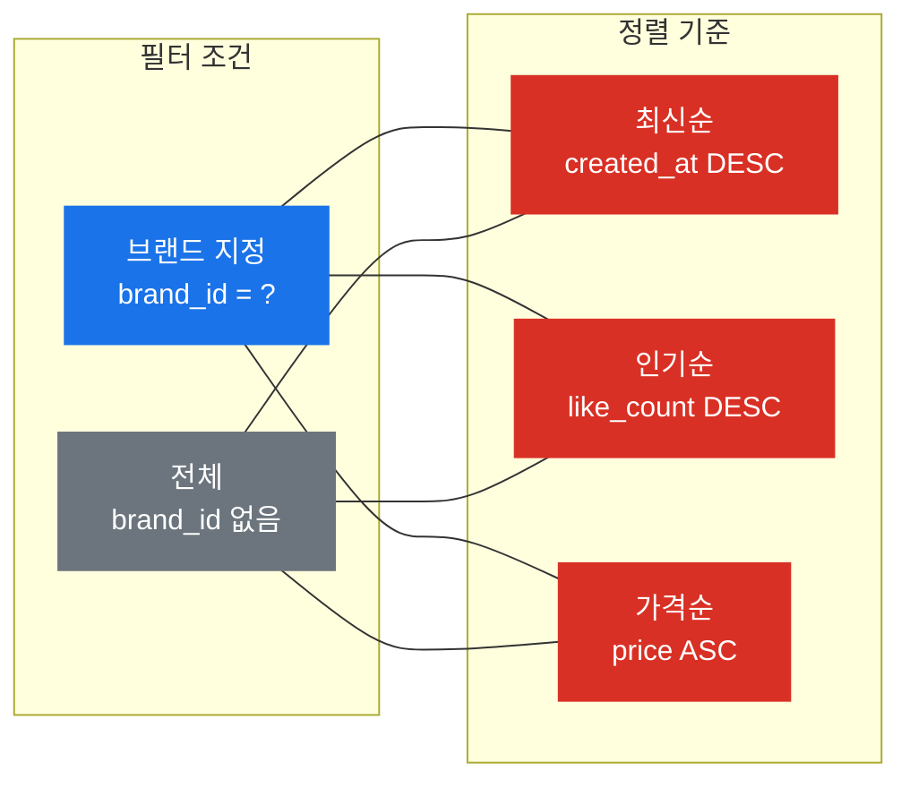
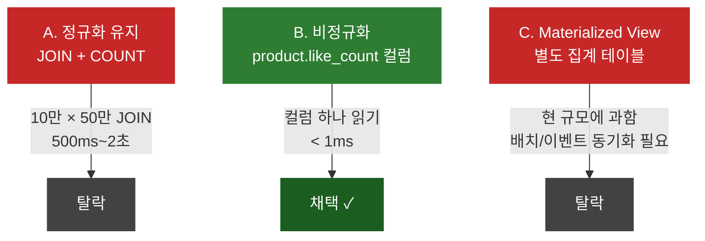
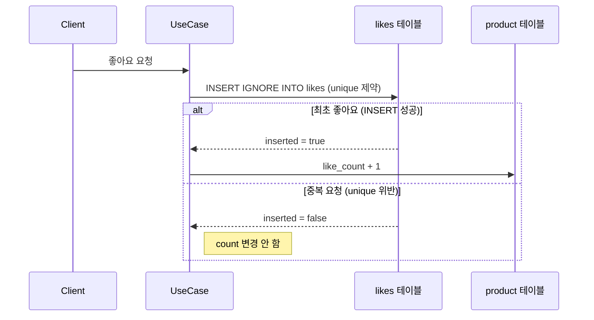
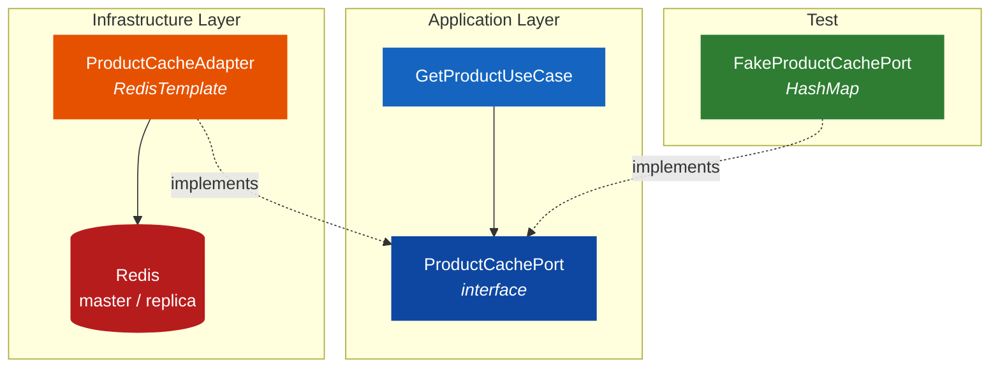
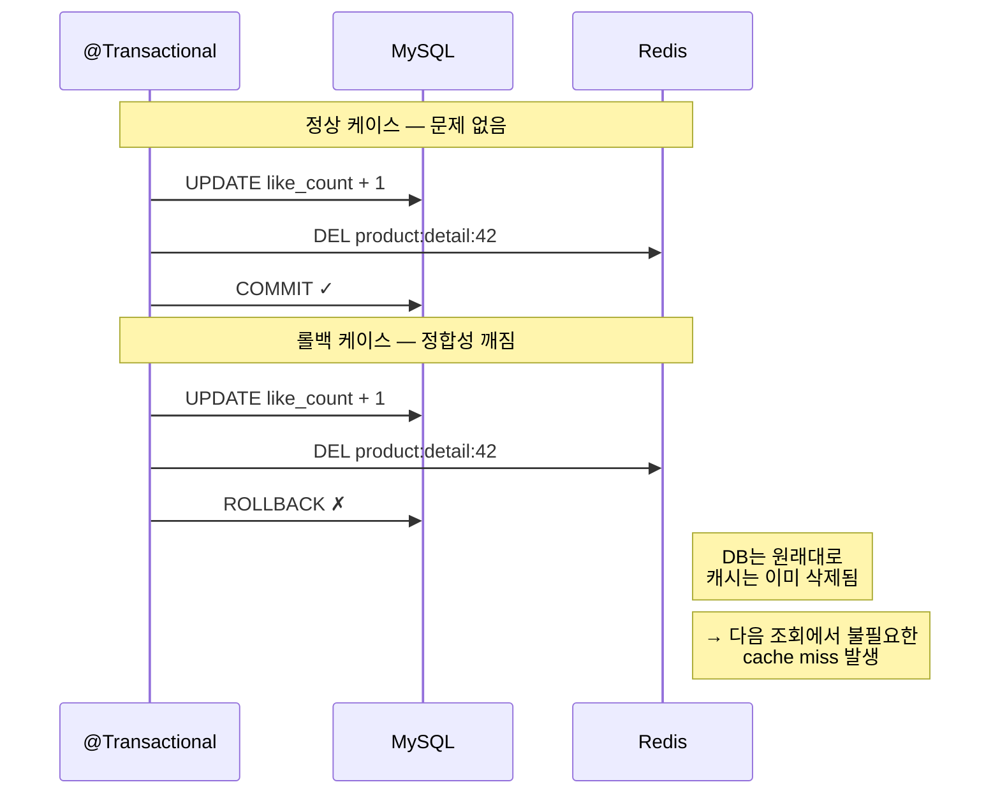
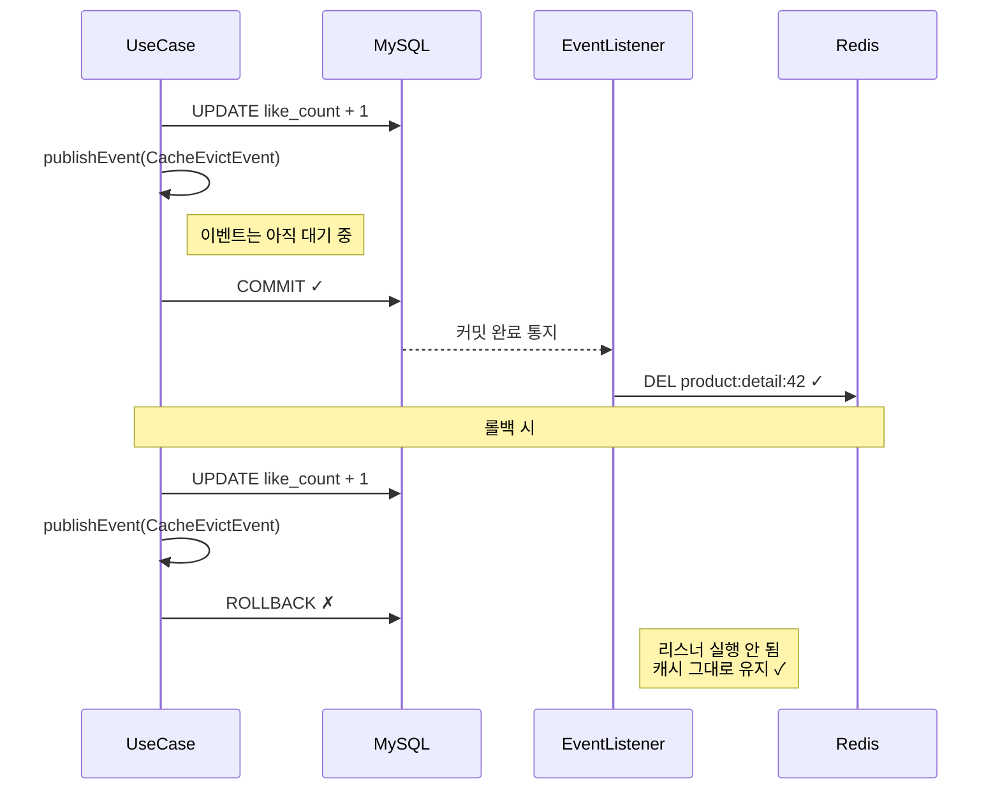
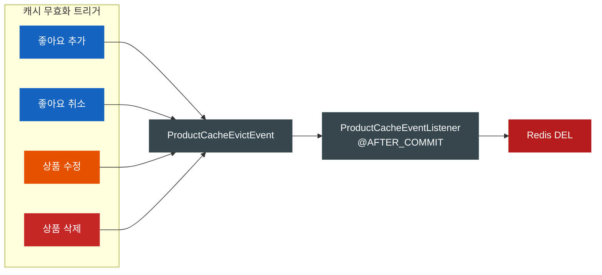
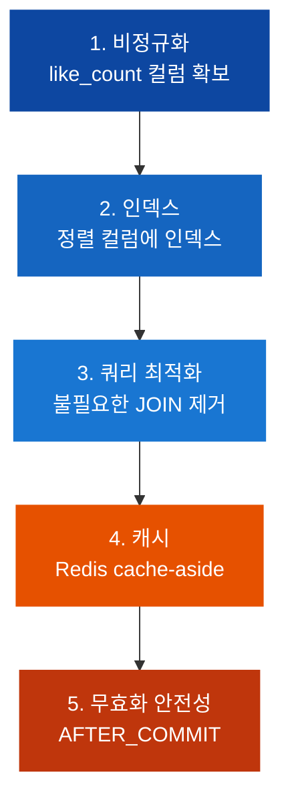

## 설계 문서에는 있고, DB에는 없었다

상품 목록 API가 느렸다.

과제는 세 가지.
인덱스 최적화, 좋아요 정렬 구조 개선, Redis 캐시 적용.

캐시부터 붙이려다가, 설계 문서 `04-erd.md`를 열어봤다.

```
idx_product_brand_created    (brand_id, created_at DESC)
idx_product_brand_like       (brand_id, like_count DESC)
```

인덱스가 정의되어 있다.
그런데 `ProductEntity.kt`를 열면:

```kotlin
@Entity
@Table(name = "product")  // indexes = ?
class ProductEntity(...)
```

`@Index`가 없다.
`ddl-auto: create` 환경이니까, Entity에 없으면 DB에도 없다.

설계서만 쓰고 구현에 안 넣은 거다.
10만 건이 인덱스 없이 돌고 있었다.

---

## EXPLAIN 찍어보기

Testcontainers로 MySQL을 띄우고, 10만 건 넣고, EXPLAIN을 찍었다.

```sql
EXPLAIN SELECT * FROM product
WHERE brand_id = 1 AND deleted_at IS NULL
ORDER BY like_count DESC LIMIT 20;
```

```
type: ALL          -- 풀 테이블 스캔
key: NULL          -- 인덱스 안 탐
rows: 99,203       -- 거의 전부 읽음
Extra: Using where; Using filesort   -- 메모리에서 정렬까지
```

`type: ALL`. 10만 행을 전부 읽는다.

`Using filesort`.
디스크(또는 메모리)에서 별도 정렬한다.
인덱스 순서로 읽으면 정렬이 필요 없는데, 인덱스가 없으니까 직접 정렬해야 한다.

실측 27ms.
이게 요청마다 반복된다.
100명이 동시에 목록을 보면, 27ms짜리 풀스캔이 100번 일어난다.

캐시를 먼저 붙이면 이 27ms가 가려진다.
cache miss가 나는 순간 풀스캔이 그대로 터지니까, 인덱스부터 잡기로 했다.

---

## 인덱스: 왜 6개가 아니라 3개인가

쿼리 패턴은 6개다.



2(필터) x 3(정렬) = 6개 조합.
인덱스를 6개 만들 수도 있었다.

**3개만 만들었다.** 브랜드 지정 조회용으로만.

```kotlin
@Table(
    name = "product",
    indexes = [
        Index(name = "idx_product_brand_created", columnList = "brand_id, created_at"),
        Index(name = "idx_product_brand_like_count", columnList = "brand_id, like_count"),
        Index(name = "idx_product_brand_price", columnList = "brand_id, price"),
    ],
)
```

**인덱스는 공짜가 아니다.**

인덱스 하나를 추가하면, 모든 INSERT와 UPDATE에서 해당 B-Tree를 갱신해야 한다.
좋아요가 눌릴 때마다 `like_count` 값이 바뀌고,
그때마다 `idx_product_brand_like_count` 트리에서 위치가 이동한다.
인덱스가 6개면 이 비용이 두 배다.

전체 조회(브랜드 미지정)는 사용 빈도가 낮다.
이쪽은 TTL 5분짜리 캐시로 커버하기로 했다.

### "deleted_at도 인덱스에 넣어야 하지 않나?"

처음에는 `(brand_id, deleted_at, like_count)` 3컬럼 인덱스를 고려했다.

그런데 소프트 딜리트 특성상,
`deleted_at IS NULL`은 전체 행의 95% 이상이 해당된다.
거의 모든 행이 "삭제 안 됨"이다.

카디널리티가 이 정도로 낮으면, B-Tree에서 갈라지는 노드가 거의 없다.
인덱스에 넣어봤자 필터링 효과가 미미하다.
`brand_id`로 2,000건까지 좁힌 다음, 행 수준에서 `deleted_at IS NULL`을 거르는 게 더 효율적이다.

인덱스에 컬럼을 추가한다고 항상 좋은 건 아니다.

### EXPLAIN 비교

인덱스를 건 뒤, 같은 쿼리를 다시 찍었다.

```
type: ref
key: idx_product_brand_like_count
rows: 2,000
Extra: Using where; Backward index scan
```


| 쿼리 | Before | After | filesort |
|------|--------|-------|----------|
| 브랜드+최신순 | ALL / 99,203 rows | ref / 2,000 rows | 제거됨 |
| 브랜드+인기순 | ALL / 99,203 rows | ref / 2,000 rows | 제거됨 |
| 브랜드+가격순 | ALL / 99,203 rows | ref / 2,000 rows | 제거됨 |
| 전체 인기순 | ALL / 99,203 rows | ALL / 99,203 rows | 유지 |

전체 인기순만 여전히 풀스캔이다.

`(brand_id, like_count)` 인덱스의 선두 컬럼 `brand_id`를 안 쓰니까 인덱스를 타지 못한다.
복합 인덱스는 **왼쪽부터 순서대로** 써야 한다.

지금은 캐시로 버티고 있지만, 이건 해결이 아니라 유예다.

`Backward index scan`이 찍히는 건 `ORDER BY like_count DESC`라서 인덱스를 역순으로 읽기 때문인데,
MySQL 8.0에서는 정상 동작이고 성능 차이도 없다.

---

## 좋아요 수: 정규화 vs 비정규화

좋아요 수로 정렬하려면 그 값이 어딘가에 있어야 한다.



B를 선택한 건, 읽기 성능만이 아니라 **동기화 전략이 단순**하기 때문이다.

```sql
-- 좋아요 추가
UPDATE product SET like_count = like_count + 1 WHERE id = ?

-- 좋아요 취소
UPDATE product SET like_count = like_count - 1 WHERE id = ? AND like_count > 0
```

`like_count = like_count + 1`은 원자적 연산이다.
두 요청이 동시에 들어와도 DB가 순서를 보장한다.

그런데 같은 사용자가 같은 상품에 좋아요를 두 번 누르면?
count가 2가 되면 안 된다.



멱등성을 애플리케이션 `if`문이 아니라 DB unique constraint가 보장한다.

INSERT가 성공했을 때만 count를 올리고,
이 둘이 하나의 트랜잭션 안에 있으니까 중간에 깨질 수 없다.

비정규화가 "정합성을 포기하는 것"이라고 흔히 말하는데,
동기화 전략이 있으면 읽기 비용을 쓰기 시점에 미리 지불하는 것에 가깝다.

---

## 캐시: 왜 @Cacheable을 안 썼는가

인덱스와 비정규화로 DB 쿼리는 빨라졌다. 1ms다.
그런데 같은 결과를 100명에게 100번 읽어줄 필요는 없다.

여기서 Redis 캐시를 얹는다.

`@Cacheable`이 가장 간결하다.
한 줄이면 된다.

그런데 이번에는 안 썼다.

이유는, **상세와 목록의 신선도 요구사항이 달랐기 때문이다.**

| 대상 | TTL | 무효화 | 이유 |
|------|-----|--------|------|
| 상품 상세 | 10분 | 변경 시 즉시 evict | 좋아요 눌렀는데 숫자가 안 바뀌면 버그처럼 보인다 |
| 상품 목록 | 5분 | TTL 만료만 | 인기순 3등이 4등 되는 게 5분 늦어도 아무도 모른다 |

목록 캐시를 좋아요마다 날리면 어떻게 될까.
인기 상품에 좋아요가 몰리는 시간대에 캐시가 계속 깨진다.
그러면 캐시를 붙인 의미가 없어진다.

캐시의 가치는 hit rate에 있고, 무효화가 잦으면 hit rate가 떨어진다.

이런 분기를 `@Cacheable` + `@CacheEvict`로 표현하면,
어노테이션이 여러 클래스에 흩어지면서
캐시에서 온 건지 DB에서 온 건지 추적이 어려워진다.

`RedisTemplate`을 직접 쓰면 코드는 길어지지만,
흐름이 코드에 드러난다.

```kotlin
fun getActiveById(id: Long): ProductInfo {
    // 1. 캐시 확인
    productCachePort.getProductDetail(id)?.let { return it }

    // 2. DB 조회
    val product = productRepository.findById(id)
        ?: throw CoreException(ErrorType.NOT_FOUND, "상품을 찾을 수 없습니다: $id")

    // 3. 캐시 저장
    val productInfo = ProductInfo.from(product, brand)
    productCachePort.setProductDetail(id, productInfo)
    return productInfo
}
```

Cache-Aside 패턴이다.
캐시를 먼저 보고, 없으면 DB에서 가져와서 캐시에 넣는다.

### 의존 방향: Port/Adapter



Application 계층의 `ProductCachePort`가 인터페이스다.
UseCase는 Redis를 모른다.

나중에 Caffeine으로 바꾸든, 2단계 캐시를 넣든,
UseCase 코드를 안 건드린다.

테스트에서는 `FakeProductCachePort`를 끼운다.
HashMap으로 구현한 Fake다.
Redis 없이 캐시 분기 로직을 검증할 수 있다.

### Redis 장애 대응

```kotlin
override fun getProductDetail(id: Long): ProductInfo? {
    return try {
        redisTemplate.opsForValue().get(detailKey(id))
            ?.let { objectMapper.readValue<ProductInfo>(it) }
    } catch (e: Exception) {
        log.warn("Redis 조회 실패 (product:detail:{}): {}", id, e.message)
        null  // cache miss → DB fallback
    }
}
```

모든 Redis 호출을 try-catch로 감쌌다.
Redis가 죽으면 전부 cache miss 처리되고, DB에서 직접 읽는다.
느려지지만 서비스가 죽지는 않는다.

읽기는 replica에서, 쓰기(SET/DEL)는 master에서.
Redis 인프라에 이미 master/replica가 구성되어 있었으니까 활용했다.

---

## 캐시 무효화: 트랜잭션 안에서 삭제하면 안 되는 이유

처음에는 이렇게 했다.

```kotlin
@Transactional
fun add(userId: Long, productId: Long) {
    // ... DB 변경 ...
    productCachePort.evictProductDetail(productId)  // 여기서 바로 삭제
}
```

잘 돌아간다.
대부분의 경우에는.

**문제는 롤백이다.**



트랜잭션이 롤백되면 DB는 원래대로인데,
**캐시는 이미 삭제된 상태**다.

다음 조회에서 DB를 다시 읽으니까
결과적으로 정합성이 맞긴 하다.

결과적으로 맞긴 하지만, 불필요한 cache miss가 발생하고 DB에 부하가 간다.
"우연히 동작하는" 코드는 조건이 바뀌면 깨진다.

`@TransactionalEventListener(phase = TransactionPhase.AFTER_COMMIT)`으로 바꿨다.

```kotlin
// UseCase: 이벤트만 발행
@Transactional
fun add(userId: Long, productId: Long) {
    // ... DB 변경 ...
    eventPublisher.publishEvent(ProductCacheEvictEvent(productId))
}

// Listener: 커밋 확정 후에만 실행
@Component
class ProductCacheEventListener(
    private val productCachePort: ProductCachePort,
) {
    @TransactionalEventListener(phase = TransactionPhase.AFTER_COMMIT)
    fun handleCacheEvict(event: ProductCacheEvictEvent) {
        productCachePort.evictProductDetail(event.productId)
    }
}
```



커밋이 확정된 후에만 캐시를 삭제한다.
롤백되면 리스너가 실행되지 않는다.

덤으로 UseCase가 `ProductCachePort`에 직접 의존하던 걸
`ApplicationEventPublisher`로 바꾸면서,
Like 도메인이 Product 캐시 구현을 몰라도 되게 됐다.

캐시 무효화 로직이 리스너 한 곳에 모이니까,
나중에 목록 캐시 evict를 추가할 때도 리스너만 수정하면 된다.

### @TransactionalEventListener를 쓸 때 알아야 할 것들

이 어노테이션은 편하지만 함정이 있다.

**`@Transactional`이 없는 메서드에서 이벤트를 발행하면, 리스너가 실행되지 않는다.**
트랜잭션이 없으니 "커밋 후"라는 시점이 존재하지 않기 때문이다.

`fallbackExecution = true`를 넣으면 트랜잭션 없을 때도 즉시 실행된다.
이 프로젝트에서는 모든 변경 UseCase에 `@Transactional`이 있으므로 문제없지만,
모르고 쓰면 "이벤트를 발행했는데 왜 안 실행되지?"로 한참 헤맨다.

**리스너는 동기로 실행된다.**
커밋 후 같은 스레드에서 돌기 때문에, Redis가 느리면 응답도 느려진다.

`@Async`를 추가하면 비동기로 바꿀 수 있지만,
예외가 호출자에게 전파되지 않고 실행 순서 보장도 안 된다.
트레이드오프가 있다.

---

## 불필요한 JOIN, 하나 빠뜨릴 뻔한 무효화

캐시를 붙이고 나서 쿼리를 다시 보니, 또 하나 보였다.

```java
// Before: 목록 조회에서 이미지까지 로드
@Query("SELECT DISTINCT p FROM ProductEntity p LEFT JOIN FETCH p.images WHERE ...")

// After: 이미지 제거
@Query("SELECT p FROM ProductEntity p WHERE ...")
```

목록 API 응답에 이미지가 없다.
그런데 쿼리에서 이미지를 JOIN FETCH하고 있었다.

이게 왜 문제인가:

- product 100건 x images 평균 3건 = **300행 결과셋** (100행이어야 할 것이)
- FETCH JOIN + 컬렉션이면 중복 행이 생겨서 `DISTINCT`가 강제됨
- 안 쓸 이미지 바이트를 네트워크로 전송하고 메모리에 올림

`LEFT JOIN FETCH p.images`를 제거하고,
매핑도 `toDomainWithoutImages()`로 바꿨다.

그리고 캐시 무효화도 빠뜨린 곳이 있었다.

좋아요 추가/취소에서만 evict를 걸었는데,
**상품 수정과 삭제에서는 안 걸었다.**
관리자가 상품 가격을 바꿨는데 캐시에 구 가격이 10분간 남아있으면 문제다.

수정/삭제 UseCase에도 evict 이벤트를 추가했다.



캐시를 도입할 때 가장 흔한 실수가 **무효화 누락**이다.
데이터를 변경하는 모든 경로를 찾아야 한다.
하나라도 빠지면 stale 데이터가 서빙된다.

---

## 전체 흐름: Before → After

```mermaid
sequenceDiagram
    participant C as Client
    participant U as UseCase
    participant R as Redis
    participant M as MySQL

    rect rgb(80, 20, 20)
        Note over C,M: AS-IS: 매 요청마다 Full Scan
        C->>U: 상품 목록 요청
        U->>M: SELECT * (type: ALL, 99,203 rows, 27ms)
        M-->>C: 응답
    end

    rect rgb(20, 60, 20)
        Note over C,M: TO-BE: Cache Hit
        C->>U: 상품 목록 요청
        U->>R: GET product:list:... (< 1ms)
        R-->>C: 캐시 응답
    end

    rect rgb(20, 40, 80)
        Note over C,M: TO-BE: Cache Miss
        C->>U: 상품 목록 요청
        U->>R: GET → null
        U->>M: SELECT * (type: ref, 2,000 rows, 1ms)
        U->>R: SET (TTL 5분)
        M-->>C: 응답
    end
```



---

## 성능 비교

10만 건, 50개 브랜드, 5회 측정 중앙값.

| 시나리오 | Before | After | 개선 |
|---------|--------|-------|------|
| 브랜드별 인기순 (DB) | 27ms / Full Scan | **1ms** / Index Scan | **96%** |
| 브랜드별 인기순 (캐시 hit) | 27ms | **< 1ms** | **~99%** |
| 상품 상세 (캐시 hit) | ~10ms | **< 1ms** | **90%** |
| 전체 인기순 (DB) | 28ms | 29ms | 없음 (인덱스 못 탐) |
| DB 커넥션 소모 | 100% | **~20%** | **80% 절감** |

전체 인기순이 개선 없는 건 예상대로다.
선두 컬럼을 안 쓰니까.
캐시로 커버 중이지만, 이건 유예일 뿐이다.

---

## 남은 것들

### 페이지네이션이 없다

`findAllActive()`가 전체 목록을 한 번에 반환한다.
10만 건을 메모리에 올리고 있다.
캐시에 10만 건 JSON을 통째로 넣고 있다.

지금은 동작하지만, 데이터가 100만 건이 되면 터진다.
Offset 기반이든 Cursor 기반이든 넣어야 한다.

### 캐시 stampede

인기 상품의 캐시 TTL이 만료되는 순간,
1,000명이 동시에 요청하면 1,000개의 쿼리가 DB에 간다.

한 요청만 DB를 읽고 나머지는 기다리는 분산 락 방식,
또는 TTL에 jitter를 넣어 만료 시점을 분산하는 방식이 있다.

### 목록 캐시 무효화

목록 캐시는 TTL로만 만료된다.
상품이 수정/삭제되어도 목록 캐시에는 구 데이터가 남는다.
5분이 지나야 반영된다.

지금 규모에서는 괜찮지만,
비즈니스가 "즉시 반영"을 요구하면 대응이 필요하다.

---

## 정리

인덱스 3개로 스캔 행 수 98% 감소, Redis 캐시로 DB 부하 80% 절감.

판단들:

- 인덱스는 6개가 아니라 **3개**. 전체 조회는 캐시로 커버.
- `deleted_at`은 인덱스에서 **제외**. 카디널리티가 낮아서 효과 없음.
- 비정규화를 **선택**. 동기화는 원자적 UPDATE + INSERT IGNORE.
- `@Cacheable` 대신 **직접 제어**. 상세/목록의 무효화 전략이 달라서.
- 캐시 evict는 **AFTER_COMMIT**. 롤백 시 불일치 제거.
- 불필요한 JOIN FETCH를 **제거**. 목록에 이미지가 필요 없으니까.

전부 비용 배분의 문제였다.
인덱스는 쓰기를 더 내고 읽기를 줄이고,
비정규화는 관리 비용을 더 내고 JOIN을 없애고,
캐시는 메모리를 더 쓰고 DB 부하를 줄인다.

그리고 이 비용 배분에는 순서가 있었다.



비정규화로 정렬 컬럼을 확보하고,
인덱스로 스캔 범위를 줄이고,
불필요한 JOIN을 걷어내고,
그 위에 캐시를 얹고,
마지막으로 캐시 무효화를 트랜잭션과 정합시켰다.

**캐시를 먼저 붙이면 인덱스 없는 쿼리를 가리는 붕대가 된다.**
붕대 밑의 상처는 cache miss가 나는 순간 그대로 터진다.

어디에 비용을 둘지 고르는 게 설계이고,
그 판단에는 순서가 있었다.
