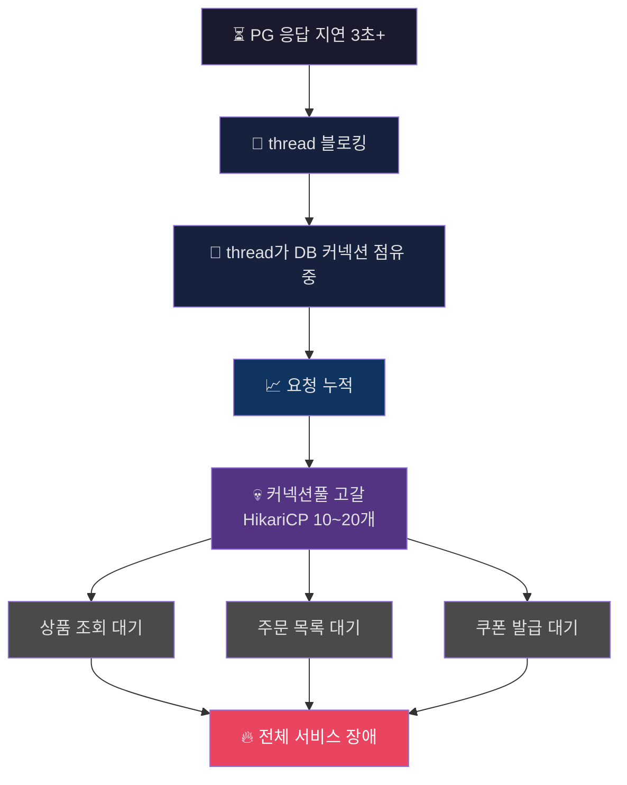
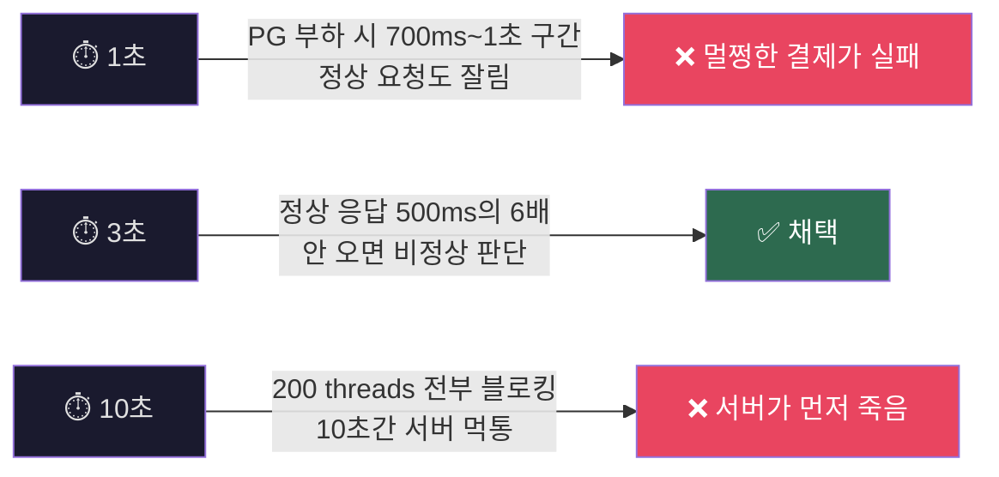
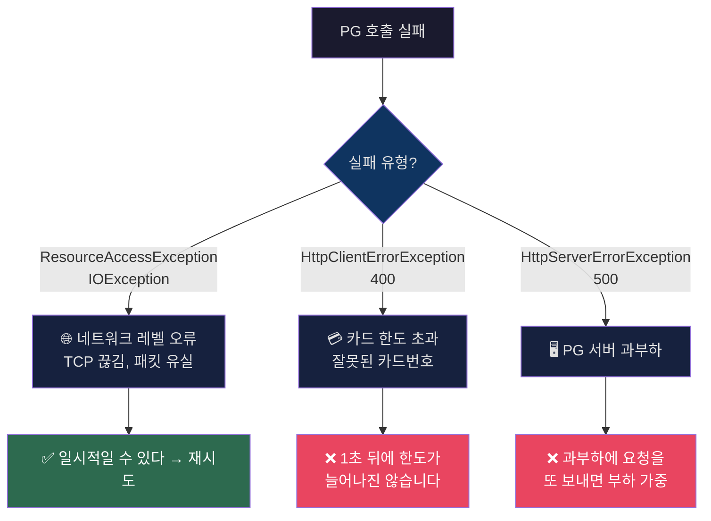
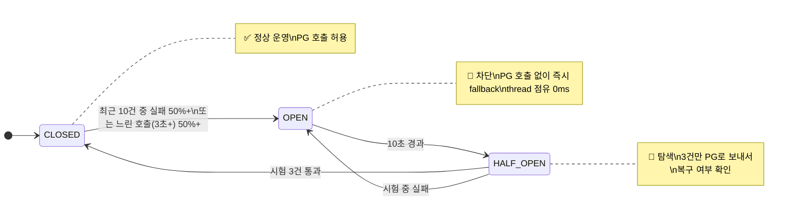
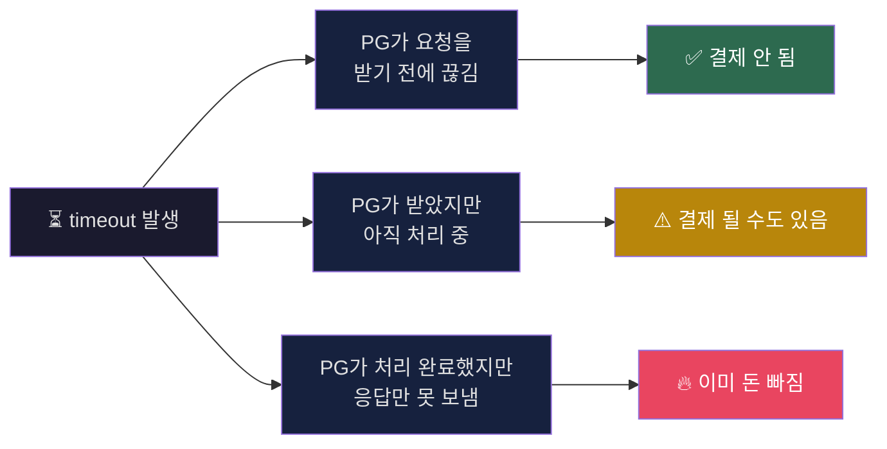
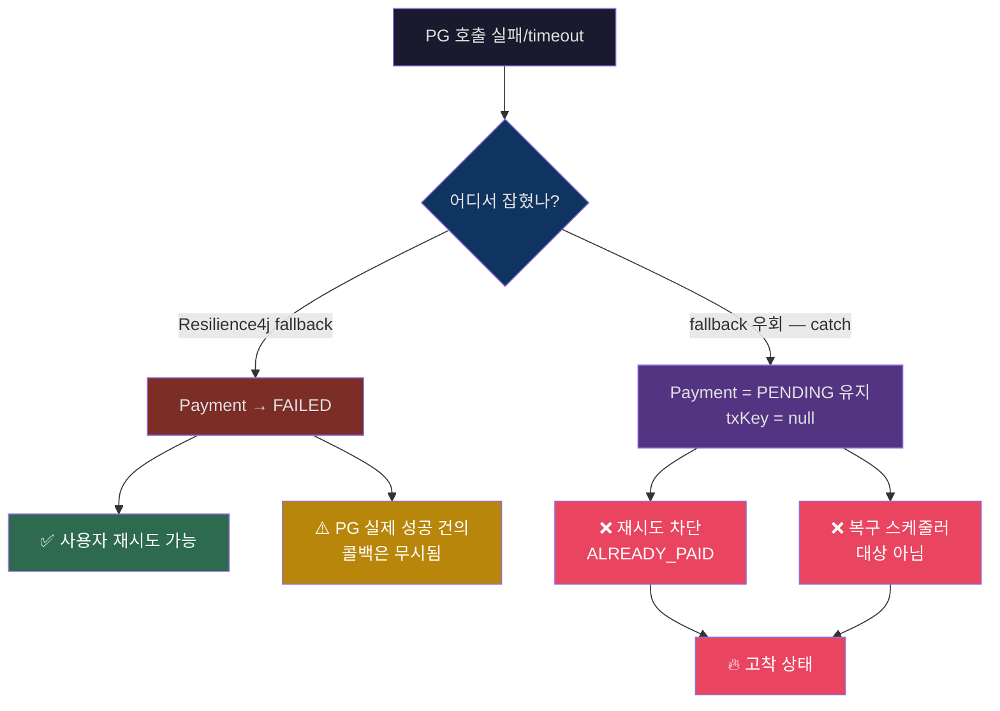
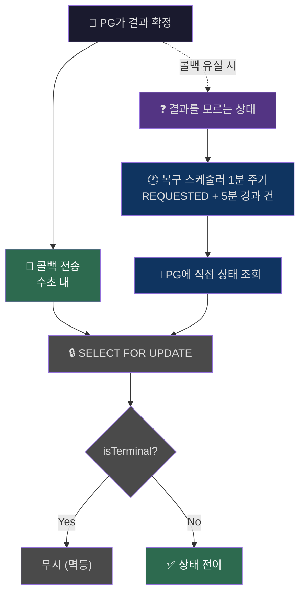
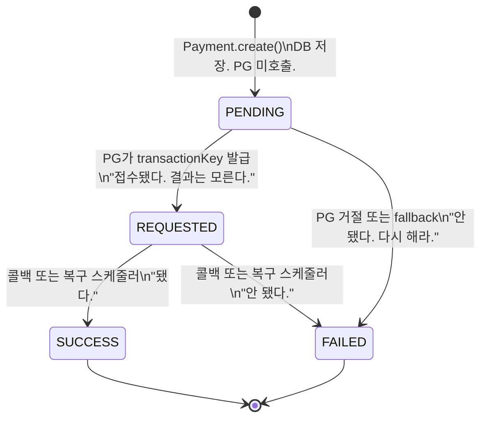

# 외부 시스템 지연은 왜 시스템 장애로 이어질수 있을까?

> **TL;DR**
>
> PG 연동 과정에서 외부 시스템이 느려졌을 때, 우리 서비스까지 같이 죽지 않으려면 어떻게 해야 하는지를 다룹니다.
>
> Timeout, Retry, Circuit Breaker를 어떤 기준으로 설정했는지.  
> 그리고 응답을 못 받은 결제 건을 어떻게 복구하는지를 다뤄요 :)

---

## 🔍 PG가 느려지면 왜 서비스 전체가 멈출까?

외부 시스템이 느려지는 상황입니다.

PG 응답이 3초씩 밀리기 시작하면, 요청을 처리하던 thread는 그 응답을 기다리는 동안 반환되지 않습니다.  
HTTP 호출은 기본적으로 동기 블로킹 방식이라,    
응답이 올 때까지 thread가 계속 점유된 상태로 남아있게 됩니다.

이 상태에서 DB 조회나 업데이트를 먼저 수행했다면,   
해당 thread는 DB 커넥션을 잡은 상태로 외부 응답을 기다리게 됩니다.

thread와 DB 커넥션이 같이 묶이는 것인데요,  
이게 몇 건 쌓이기 시작하면 상황이 달라집니다.

HikariCP 같은 커넥션 풀은 보통 10~20개 수준인데,   
외부 응답을 기다리는 요청이 이걸 점유하고 있으면 새로운 요청은 DB 커넥션을 얻지 못하고 대기하게 됩니다.

> *여기서부터, 결제와 상관없는 API까지 영향을 받습니다.*



실패는 빨리 끝납니다. thread도 커넥션도 바로 반환됩니다.

지연은 끝나지 않고, thread와 커넥션을 쥔 채로 남아있습니다.
그게 쌓이고, 결국 퍼지게 됩니다.

실패가 아니라 지연 때문에 발생한 문제였습니다.

&nbsp;

여기에 더 위험한 시나리오는 다음과 같아요.

PG가 결제를 성공시켰는데, 응답이 돌아오는 도중에 timeout으로 잘린 경우입니다.  
PG 쪽에서는 카드사 승인이 완료되어 사용자 돈이 빠진 상태인데,   
우리 시스템은 응답을 못 받았으니 "실패"로 알고 있습니다.

그야말로, 결제는 되었는데 유저 입장에서는 서비스를 이용할 수가 없는 상황이 되는 거죠.

그래서 질문을 바꿨습니다. "어떻게 처리할 것인가"가 아니라 **"얼마나 빨리 포기하고, 모르는 상태를 어떻게 다룰 것인가"** 로요.

첫 번째로 결정해야 했던 건, PG 응답을 얼마나 기다릴 것인가? 였습니다.

---

## ⏱️ 그러면 얼마나 빨리 끊어야 할까요?

```yaml
payment.pg:
  connect-timeout: 1000   # TCP 연결 수립까지 허용하는 시간
  read-timeout: 3000      # PG 응답을 기다리는 최대 시간
```

PG 정상 응답이 100~500ms인 상황에서, read-timeout을 어디에 놓을지가 첫 번째 판단이었습니다.



3초는 타협입니다.

1초는 정상 요청도 잘라냅니다.
10초는 서버가 먼저 죽습니다.
남는 구간이 3초였습니다.

이건 정확도의 문제가 아니라, **어디까지 같이 죽을 것인가**를 정하는 문제였습니다.

> 📌 **포기한 것**: PG가 2.8초에 승인을 완료했지만 응답이 3.1초에 도착하는 경우, 이 응답은 버려집니다. 유저 입장에서는 결제가 됐는데 주문이 안 잡히는 상황이 생길 수 있습니다.

그런데 3초 만에 끊었다고 해서 바로 실패로 확정하기엔 아쉽습니다. 네트워크가 순간적으로 흔들린 거라면, 한 번 더 시도하면 성공할 수도 있으니까요.

---

## 🔄 끊었는데, 다시 시도해야 할까?

```yaml
resilience4j.retry.instances.pgRetry:
  max-attempts: 2
  wait-duration: 1s
  retry-exceptions:
    - org.springframework.web.client.ResourceAccessException
    - java.io.IOException
```

timeout이 발생하면 재시도를 고려해야 합니다.

그런데 재시도를 전부 허용하면 오히려 더 망가집니다.



max-attempts를 몇 회로 잡을지는, 결국 유저가 얼마나 기다릴 수 있느냐로 귀결됩니다.

| 시도 횟수 | 최대 대기 | 판단 |
|-----------|----------|------|
| 2회 | 7초 (3초 x 2 + 1초 대기) | 사용자가 참을 수 있는 한계 |
| 3회 | 11초 | 유저가 이탈하거나 새로고침해서 중복 요청이 생깁니다 |

2회 연속 timeout이면 PG 쪽 문제일 가능성이 높습니다.
한 번 더 보내봐야 같은 결과에요.

> 📌 **포기한 것**: PG 500이 GC pause 같은 순간 부하여서,   
> 1초 뒤면 정상 응답을 줄 수 있는 경우에도 재시도 없이 실패 처리됩니다.

한 가지 더 생각해볼 게 있습니다.   
2회 다 실패했다는 건, 이 요청 하나의 문제가 아니라 PG 자체가 불안정한 상태일 수 있다는 뜻인데.

그러면 다음 요청도 계속 PG에 보내는 게 맞을까요?

---

## 🚫 재시도도 실패하면, 계속 보내야 할까?

```yaml
resilience4j.circuitbreaker.instances.pgCircuit:
  sliding-window-size: 10
  failure-rate-threshold: 50
  wait-duration-in-open-state: 10s
  permitted-number-of-calls-in-half-open-state: 3
  slow-call-duration-threshold: 3s
  slow-call-rate-threshold: 50
```

최근 10건 중 5건이 실패했다면, PG가 정상 동작하지 않는 상태로 봐야 했어요.
이 상태에서 계속 보내면, 요청마다 최대 7초간 thread가 블로킹되고, 지연이 쌓이고, 커넥션풀이 고갈되고, 전체 장애로 퍼지게 됩니다.

그래서 Circuit Breaker가 열리면 PG 호출 자체를 하지 않고, 즉시 fallback을 반환하도록 했습니다.



| 설정 | 값 | 왜 이 값인가 |
|------|-----|-------------|
| sliding-window | 10 | 100으로 잡으면 50건 터지는 동안 계속 보내게 됩니다 |
| slow-call-threshold | 3초 | read-timeout과 같은 기준입니다. 2.9초짜리가 반복되면 곧 timeout 납니다 |
| wait-duration | 10초 | 30초면 PG가 살아나도 20초간 결제가 막힙니다 |

> 📌 **포기한 것**: CB OPEN 10초 동안 들어오는 모든 결제는, PG가 50%는 성공시키고 있었더라도 시도조차 하지 않고 실패합니다.

Timeout, Retry, Circuit Breaker까지 적용하면 "언제 끊을지, 뭘 재시도할지, 언제 안 보낼지"는 정해진 셈입니다. 그런데 여기서 풀리지 않는 문제가 하나 남습니다. timeout이 났을 때, 이걸 정말 "실패"로 봐도 되는 걸까요?

---

## ❓ timeout이 났는데, 이걸 실패로 봐도 될까요?

여기가 이 설계에서 가장 어려운 지점이었습니다.

timeout이 발생했을 때, 이 요청의 실제 결과는 세 가지 중 하나입니다.



우리 쪽에서는 이 셋을 구분할 방법이 없습니다. 아는 건 하나뿐입니다. **"모른다."**

&nbsp;

이 "모름"을 FAILED로 확정하면, 세 번째 경우가 문제가 됩니다.

PG는 카드사 승인을 완료하고 돈을 빼간 상태인데, 우리는 "실패"라고 확정한 겁니다.
PG에서 뒤늦게 콜백이 와도 Payment가 이미 FAILED(최종 상태)이므로 무시되고요.
유저는 돈이 빠졌는데 "결제 실패"를 보게 됩니다.

현재 구현에는 두 경로가 존재합니다.



이게 이 설계의 가장 큰 트레이드오프라고 생각합니다.

"빠르게 실패 처리해서 재시도를 열어준다"는 결정이,   
"PG가 실제로 성공한 결제를 실패로 덮어쓸 수 있다"는 리스크를 만들기 때문입니다.  
완전한 해결은 결제 취소 API나 정산 대사 시스템이 필요한 영역이라고 보고 있습니다.

지금까지는 PG 호출 자체를 어떻게 다룰지에 대한 이야기였는데요,   
사실 이 모든 것보다 먼저 결정해야 할 게 하나 있었습니다.

PG를 호출하는 동안 DB 커넥션을 잡고 있을 것인가, 말 것인가입니다.

---

## 🏗️ 그런데 왜 트랜잭션을 쪼갰을까요?

앞에서 PG 지연이 thread를 묶고, thread가 DB 커넥션을 묶는 문제를 이야기했습니다.   
해당 문제를 끊으려면 PG 호출 시점에 DB 커넥션을 잡고 있지 않으면 되는데요.

`@Transactional` 안에서 PG를 호출하면 트랜잭션이 시작되면서 획득한 DB 커넥션이 PG 응답을 기다리는 동안 계속 점유되기 때문에,  
트랜잭션을 세 조각으로 쪼개는 방식을 택했습니다.

```mermaid
sequenceDiagram
    participant UC as RequestPaymentUseCase<br/>(트랜잭션 없음)
    participant TxSvc as PaymentTransaction<br/>Service
    participant DB as MySQL
    participant PG as PG 시뮬레이터

    rect rgb(40, 60, 90)
        Note over TxSvc,DB: 🟦 트랜잭션 #1 — ~10ms
        UC->>TxSvc: createPendingPayment()
        TxSvc->>DB: 주문 검증 + Payment INSERT(PENDING)
        TxSvc-->>UC: {paymentId, amount}
        Note over DB: ✅ 커밋. 커넥션 반환.
    end

    rect rgb(90, 50, 30)
        Note over UC,PG: 🟧 트랜잭션 밖 — 최대 7초
        UC->>PG: requestPayment()
        PG-->>UC: {transactionKey} 또는 실패
        Note over UC: DB 커넥션 점유 없음
    end

    rect rgb(30, 70, 50)
        Note over TxSvc,DB: 🟩 트랜잭션 #2 — ~10ms
        UC->>TxSvc: markRequested() 또는 markFailed()
        TxSvc->>DB: UPDATE payment
        Note over DB: ✅ 커밋. 커넥션 반환.
    end
```



| 어떻게 묶느냐 | DB 커넥션 점유 시간 | 리스크 |
|--------------|-------------------|--------|
| 하나의 트랜잭션 | ⚠️ 최대 7초 | 10건이면 커넥션풀이 바닥나고 전체 장애 |
| 쪼갠 트랜잭션 | ✅ ~20ms | 트랜잭션 #1 커밋 후 서버 죽으면 PENDING 고착 |

커넥션풀 고갈은 **전체 서비스 장애**이고, PENDING 고착은 **해당 주문 1건의 문제**입니다.   
둘 중 어떤 리스크를 안을지는 선택의 여지가 없었습니다.

트랜잭션을 쪼갰다는 건, Payment가 PENDING이나 REQUESTED 상태로 한동안 남아있을 수 있다는 뜻이기도 합니다.   
그러면 이 상태를 언제, 어떻게 최종 확정할 것인가가 다음 문제가 됩니다.

---

## 🔄 콜백이 안 오면 어떻게 하나요?

PG는 비동기로 결제를 처리한 뒤 콜백으로 결과를 보내주는데,    
콜백은 안 올 수도 있습니다. 네트워크 장애, 서버 다운, PG 버그 등 이유는 다양합니다.     
콜백에 100% 의존하면 결과를 영원히 모르는 건이 생기기 때문에,

콜백은 "빠른 경로"로만 보고 **복구 스케줄러를 안전망으로 두었습니다.**



5분이라는 기준은 PG 비동기 처리 최대 5초에 콜백 지연까지 감안하여 설정하였어요.     
1분이면 PG가 아직 처리 중인 건을 조회하게 되고,     
10분이면 사용자가 너무 오래 기다리게 되기떄문에.

콜백 중복이나 콜백과 스케줄러가 동시에 같은 건을 처리하려는 경우를 방어하기 위해 `SELECT FOR UPDATE` + `isTerminal()` 체크를 두었습니다.  
먼저 도착한 쪽이 처리하고, 나중 쪽은 무시하는 방식입니다.

> 📌 **포기한 것**: REQUESTED 상태가 최대 5분간 지속됩니다. 유저 입장에서는 "결제 버튼 눌렀는데 아무 반응이 없는" 상태가 5분간 이어질 수 있습니다.

여기까지의 판단들 — timeout, retry, circuit breaker, fallback 처리, 트랜잭션 분리, 콜백 + 복구 — 이 결국 하나로 모이는 지점이 있습니다. Payment의 상태 설계입니다.

---

## 📊 Payment 상태의 플로우

이제 모든 판단이 결국 하나로 모이는데요,   
각 상태가 "지금 무엇을 알고 무엇을 모르는가"를 표현하면 다음과 같습니다.



| 상태 | 의미 | Order 영향 |
|------|------|-----------|
| `PENDING` | PG에 보냈는지조차 모릅니다 | 없음 |
| `REQUESTED` | PG가 접수했습니다. 결과는 모릅니다 | 없음 |
| `SUCCESS` | 결제 확정 | ✅ **Order → COMPLETED** |
| `FAILED` | 실패 확정. 재시도 가능 | 없음 (Order는 PENDING 유지) |

SUCCESS일 때만 Order가 COMPLETED로 전이하고, FAILED여도 Order는 PENDING을 유지하도록 했습니다. 사용자가 다른 카드로 다시 시도할 수 있게 하기 위해서입니다.

---

## ⚖️ 트레이드오프 전체 정리 !

| 결정 | 얻은 것 | 포기한 것 |
|------|---------|----------|
| read-timeout 3초 | thread 점유 최소화 | 3초 이후 도착한 PG 성공 응답은 버림 |
| Retry 네트워크 오류만, 2회 | 불필요한 재시도 차단 | PG 500이 순간 부하여도 재시도 안 함 |
| CB open 시 즉시 fallback | 서버 가용성 보호 | 10초간 모든 결제 차단 |
| fallback 시 PENDING 유지 + orderId 복구 | PG 성공 건 유실 방지 | 최대 5분간 결과 미확정 |
| 트랜잭션 분리 | DB 커넥션풀 보호 | PENDING 고착 가능성 |
| 복구 스케줄러 5분 | 콜백 유실 보상 | 최대 5분간 결과 미확정 |

---

## 🔧 timeout 났는데 PG에서는 성공한 경우, 어떻게 잡을까?

timeout이 나면 PG가 요청을 받았는지조차 모릅니다.
이 상태를 바로 FAILED로 확정하면, PG가 실제로 성공시킨 건의 콜백이 무시됩니다.
유저는 돈이 빠졌는데 주문이 안 잡힌 상태가 되고요.

PG에 `GET /api/v1/payments?orderId=` API가 있기 때문에, orderId로 PG에 거래가 있는지 확인할 수 있습니다.
그래서 timeout이 나면 FAILED로 전이하지 않고 PENDING을 유지한 뒤,   
복구 스케줄러가 orderId로 PG에 직접 물어보는 방식을 택했습니다.

PG에 거래가 있으면 txKey를 받아서 결과를 반영하고, 거래가 없으면 그때 FAILED로 전이시킵니다.
이 방식이면 유저 돈이 빠졌는데 주문이 안 잡히는 상황이 생기지 않습니다.

다만 REQUESTED 상태에서 유저가 결과를 모르는 시간이 최대 5분 정도 발생할 수 있는데,   
이건 프론트에서 polling이나 push로 풀어야 하는 영역이라 서버 코드만으로는 줄이기 어렵네요...

---

## 결론

결제가 정확하게 맞아떨어지는 시스템을 만든 건 아닙니다.
결제 시스템이 망했을 때, 같이 죽지 않는 시스템을 만든 겁니다.
