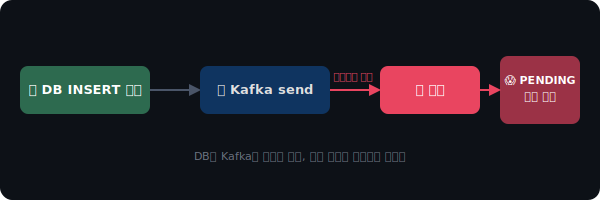
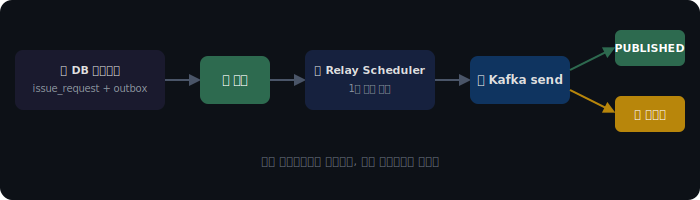
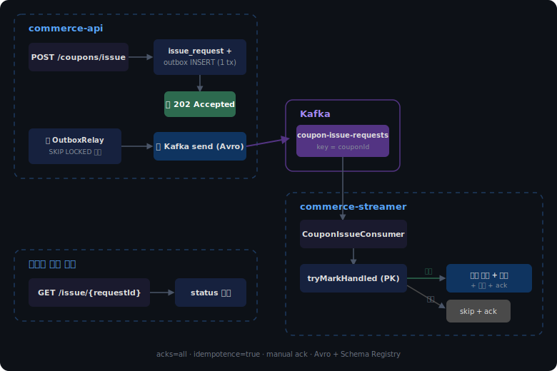
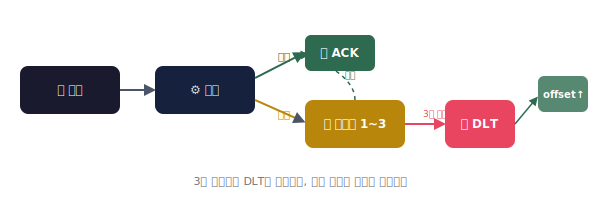

# 선착순 100장 쿠폰에 1만 명이 몰리면, 시스템은 어떻게 버텨야 할까?

> **TL;DR**
>
> 선착순 쿠폰 발급을 동기 API로 처리하면, 트래픽이 몰리는 순간 DB 락 경합과 커넥션 풀 고갈로 서비스 전체가 마비됩니다.
>
> Kafka를 버퍼로 두고, Outbox 패턴으로 발행을 보장하고, Consumer에서 멱등하게 처리하는 구조를 만들었습니다.
> 그 과정에서 Redis로 할지 Kafka로 할지, DB로 멱등 처리할지 Redis로 할지, 선택의 순간마다 뭘 포기했는지를 기록합니다.

---

## ✉️ "쿠폰 발급해라" vs "쿠폰이 발급됐다" — 이게 왜 중요할까?

구현에 들어가기 전에, 이 구조를 왜 이벤트로 바꿨는지부터 이야기해야 할 것 같습니다.

처음에는 주문 흐름 안에서 쿠폰 차감, 재고 차감, 결제까지 한 번에 처리했습니다.
`CreateOrderUseCase` 안에서 `couponService.use()`, `stockService.decrease()`, `paymentService.pay()`를 순서대로 호출하는 구조였는데요, 돌이켜보면 이건 Command 방식이었어요.
"쿠폰을 사용해라", "재고를 차감해라", "결제를 실행해라" — 호출자가 후속 처리의 내용과 순서를 전부 알고 있어야 하는 구조입니다.

문제는 후속 로직이 하나 추가될 때마다 `CreateOrderUseCase`가 뚱뚱해진다는 거였어요.
포인트 적립이 추가되면 `pointService.record()`를 넣어야 하고, 알림이 추가되면 `notificationService.send()`를 넣어야 합니다.
주문을 만드는 코드가 쿠폰, 재고, 결제, 포인트, 알림을 전부 알고 있는 상태가 됩니다.

Event 방식으로 바꾸면 흐름이 달라집니다.
`CreateOrderUseCase`는 "주문이 생성됐다"는 사실만 발행하고, 후속 처리는 각자 알아서 반응합니다.
주문 쪽은 쿠폰이 어떻게 차감되는지, 포인트가 어떻게 적립되는지 몰라도 됩니다.
새로운 후속 로직이 필요하면 리스너만 추가하면 되니까, 주문 코드를 건드리지 않아도 됩니다.

다만 이 방식에는 대가가 있습니다.
흐름이 눈에 보이지 않게 되고, 후속 처리가 실패해도 호출자에게 알려지지 않습니다.
"쿠폰 차감이 실패했는데 주문은 성공한 상태"가 생길 수 있어요.
그래서 이벤트로 분리할 때는 "이 후속 처리가 실패해도 핵심 트랜잭션은 유효한가?"를 기준으로 판단했습니다.

📌 **포기한 것** — 한 눈에 보이는 제어 흐름.
디버깅 시 "이 이벤트를 누가 처리하는지"를 찾아야 하는 간접성이 생겼습니다.

이벤트를 쓰겠다고 결정하니, 바로 다음 질문이 떠올랐습니다.

---

## 🔀 그러면 Spring ApplicationEvent로 충분할까, Kafka까지 가야 할까?

Spring `ApplicationEventPublisher`로 충분한 건 뭐고, Kafka까지 가야 하는 건 뭘까.

ApplicationEvent는 같은 JVM 안에서 동작합니다.
메모리 기반이라 빠르고, `@TransactionalEventListener`로 커밋 이후 실행을 보장할 수 있습니다.
좋아요 집계처럼 "같은 서버 안에서 후속 처리"만 필요한 경우에는 이걸로 충분합니다.

그런데 서비스 경계를 넘어야 하는 순간, ApplicationEvent로는 안 됩니다.
`commerce-api`에서 발생한 이벤트를 `commerce-streamer`라는 별도 애플리케이션이 처리해야 하니까요.
JVM이 다르면 `ApplicationEventPublisher`가 도달하지 못합니다.

왜 별도 애플리케이션으로 분리했냐면, Consumer가 죽어도 API가 살아있어야 하기 때문입니다.
metrics 집계가 느려지거나 장애가 나도, 사용자의 상품 조회나 주문은 정상 동작해야 합니다.
같은 JVM에 있으면 Consumer의 thread 점유나 메모리 이슈가 API에 직접 영향을 줄 수 있어서, 배포와 스케일링도 독립적으로 가능한 구조를 택했습니다.

아직 정답이라고 확신하는 건 아니지만, 나름의 기준은 이렇게 잡아봤습니다.

같은 JVM 안에서 끝나고, 후속 처리가 실패해도 핵심 로직에 영향이 없고, 데이터가 유실되어도 괜찮은 경우라면 ApplicationEvent로 충분하다고 느꼈어요.
반면에 서비스 경계를 넘어야 하거나, 메시지를 보존해야 하거나, 나중에 재처리할 수 있어야 한다면 Kafka가 필요했습니다.

📌 **포기한 것** — ApplicationEvent의 단순함.
Kafka를 도입하면서 브로커 운영, Schema Registry, Consumer 모니터링이라는 인프라 부담이 생겼습니다.

Kafka로 가겠다고 결정했으니, 이제 선착순 쿠폰 발급을 실제로 어떻게 처리할지를 고민해야 했습니다.

---

## 🔥 동기로 처리하면 뭐가 터질까?

제일 먼저 가장 단순한 설계부터 검토했습니다.

사용자가 쿠폰 발급 API를 호출하면, 하나의 트랜잭션 안에서 쿠폰 수량을 확인하고, 차감하고, 유저 쿠폰을 저장합니다.
평소에는 문제가 없어요.

그런데 1만 명이 동시에 누르면 이야기가 달라집니다.

`UPDATE coupon SET issued_count = issued_count + 1 WHERE id = ? AND issued_count < max_issue_count` 이 쿼리가 동시에 1만 번 실행되면, 같은 row에 대한 InnoDB row lock 경합이 발생합니다.
한 트랜잭션이 lock을 잡고 있는 동안 나머지 9,999개 요청은 전부 대기하게 되고, DB 커넥션 풀이 순식간에 고갈됩니다.

커넥션 풀이 비면 쿠폰과 상관없는 상품 조회, 주문 목록 같은 API까지 같이 죽습니다.
문제는 쿠폰인데, 죽는 건 서비스 전체인 거죠.


그래서 발급 요청 자체를 동기로 처리하면 안 되겠다고 판단했습니다.
API는 "요청을 접수했다"만 응답하고, 실제 발급은 다른 곳에서 순차적으로 처리해야 합니다.

📌 **포기한 것** — 즉시 응답으로 "발급 성공/실패"를 알려주는 UX.
"정확히 100장만 발급"과 "즉시 결과 응답" 중 전자를 택했고, 사용자는 발급 요청 후 별도로 결과를 polling 해야 합니다.

비동기로 처리하겠다고 결정하니, 자연스럽게 다음 질문이 따라왔습니다.

---

## 🤔 그러면 버퍼를 Redis로 하면 안 될까?

Redis를 쓰면 `DECR`로 원자적 수량 차감이 가능하고, 응답 속도도 마이크로초 단위라 빠릅니다.
실제로 많은 서비스에서 이 방식을 쓰고 있어요.

그런데 Redis로 선착순을 처리하면, "Redis에서 수량은 줄었는데 DB 저장에 실패한 경우"를 별도로 보상해야 합니다.
Redis와 DB는 서로 다른 저장소이기 때문에 하나의 트랜잭션으로 묶을 수 없고, 결국 Redis에서 먼저 차감하고 DB에 저장하는 순서를 정해야 하는데, 중간에 실패하면 수량이 영구적으로 어긋날 수 있습니다.

Kafka를 쓰면 이 문제가 구조적으로 해소됩니다.
API는 발급 요청을 Kafka에 넣기만 하고, Consumer가 하나의 트랜잭션 안에서 수량 확인, 차감, 저장을 전부 처리합니다.
Consumer는 단일 스레드로 동작하기 때문에 lock 경합 자체가 줄어들고, 트래픽이 몰려도 Kafka가 버퍼 역할을 해서 Consumer는 자기 페이스로 처리할 수 있습니다.
다만 버퍼가 만능은 아닌 게, Consumer 처리 속도보다 Producer 유입 속도가 계속 빠르면 결국 backlog가 쌓이고 발급 지연이 커집니다.
consumer lag이 임계치를 넘으면 Consumer를 scale-out 하거나 partition을 늘려야 하는데, 이건 운영 단계의 모니터링이 전제되어야 가능한 대응입니다.

이때 partition key를 `couponId`로 잡았는데요, 같은 쿠폰에 대한 발급 요청이 같은 partition에 모이면 해당 쿠폰의 수량 차감이 순서대로 처리됩니다.
`userId`를 key로 잡으면 같은 사용자의 중복 발급 방지에는 유리하지만, 서로 다른 사용자의 요청이 다른 partition으로 흩어져서 수량 초과가 발생할 수 있습니다.
랜덤 key를 쓰면 throughput은 올라가지만 순서 보장이 완전히 사라지고요.
선착순이라는 요구사항에서는 "같은 쿠폰의 순서 보장"이 가장 중요하다고 판단해서 `couponId`를 택했습니다.

| 비교 항목 | Redis DECR 방식 | Kafka Consumer 방식 |
|----------|----------------|-------------------|
| 수량 차감 | Redis에서 원자적 DECR, DB 저장은 별도 | Consumer가 DB 트랜잭션 안에서 한 번에 처리 |
| 정합성 | Redis-DB 불일치 보상 로직 필요 | 단일 DB 트랜잭션으로 보장 |
| 처리 속도 | 매우 빠름 (마이크로초) | 상대적으로 느림 (밀리초, 네트워크 I/O 포함) |
| 동시성 제어 | Redis 자체가 단일 스레드로 경합 없음 | Kafka partition 단위 순서 보장으로 경합 감소 |
| 장애 시 복구 | Redis 휘발성, 보상 트랜잭션 설계 필요 | Kafka에 메시지가 보존되어 재처리 가능 |

📌 **포기한 것** — Redis DECR의 마이크로초 응답 속도.
Kafka를 거치면 발급까지 수백 밀리초에서 수 초가 걸리지만, 정합성을 택했습니다.

다만 솔직히 말하면, 모든 상황에서 Kafka가 정답인 건 아닙니다.
쿠폰이 마케팅용이라 "약간의 초과 발급은 괜찮다"는 비즈니스 요구라면, Redis DECR이 훨씬 합리적입니다.
TTL 기반 자동 만료가 필요한 경우에도 Redis가 더 자연스럽고요.
이번에는 "정확히 100장만 발급되어야 한다"는 전제였기 때문에 Kafka를 택했는데, 만약 그 전제가 달랐다면 저도 Redis를 선택했을 것 같습니다.

Kafka를 버퍼로 쓰기로 했으니, 이제 API에서 Kafka로 메시지를 보내면 끝일 줄 알았습니다.

---

## 📮 그런데 Kafka에 안 넣어질 수도 있다

`kafkaTemplate.send()`를 호출하면 될 것 같았는데, 여기에 함정이 있었습니다.

쿠폰 발급 요청을 DB에 저장하고(`coupon_issue_request` INSERT), 그 직후 Kafka에 메시지를 보내는 구조를 생각해 봤습니다.
DB 저장은 성공했는데 Kafka 전송이 네트워크 에러로 실패하면 어떻게 될까요?

사용자는 "요청 접수됨"이라는 응답을 받았지만, Consumer에는 메시지가 도착하지 않습니다.
발급 요청이 영원히 PENDING 상태로 남게 됩니다.

반대로 Kafka를 먼저 보내고 DB를 저장하면, Kafka에는 메시지가 갔는데 DB 저장이 실패해서 Consumer가 존재하지 않는 요청을 처리하려는 상황이 생깁니다.

두 저장소에 동시에 쓰는 행위는 분산 트랜잭션 문제라서, 순서를 어떻게 바꿔도 불일치가 발생할 수 있습니다.



이 문제를 해결하기 위해 Transactional Outbox 패턴을 적용했습니다.

Kafka에 직접 보내는 대신, DB 트랜잭션 안에서 `outbox_event` 테이블에 메시지를 함께 저장합니다.
`coupon_issue_request` INSERT와 `outbox_event` INSERT가 같은 트랜잭션이니까, 둘 다 성공하거나 둘 다 실패합니다.

```kotlin
// 같은 @Transactional 안에서 발급 요청 + outbox 이벤트를 함께 저장
@Transactional
fun request(userId: Long, couponId: Long): String {
    val requestId = UUID.randomUUID().toString()
    couponIssueRequestRepository.save(
        CouponIssueRequest.create(requestId, couponId, userId)
    )
    outboxEventRepository.save(
        OutboxEvent.create(
            eventId = requestId,
            eventType = "COUPON_ISSUE_REQUESTED",
            topic = KafkaTopics.COUPON_ISSUE_REQUESTS,
            partitionKey = couponId.toString(),
            payload = """{"eventType":"COUPON_ISSUE_REQUESTED","requestId":"$requestId","couponId":$couponId,"userId":$userId}""",
        )
    )
    return requestId
}
```

그리고 별도의 스케줄러(`OutboxRelayScheduler`)가 1초마다 outbox 테이블을 폴링해서, PENDING 상태의 이벤트를 Kafka로 전송합니다.
전송 성공하면 PUBLISHED로 마킹하고, 실패하면 다음 주기에 재시도합니다.

여기서 주의한 건, 스케줄러의 트랜잭션 범위입니다.
처음에는 `@Transactional` 안에서 SELECT + Kafka send + 상태 업데이트를 전부 했는데, Kafka send가 느려지면 `FOR UPDATE` 잠금을 수백 초간 보유하면서 DB 커넥션 풀이 고갈되는 문제가 있었습니다.

그래서 트랜잭션을 3단계로 분리했습니다.

```kotlin
// 1단계: 트랜잭션 안에서 SELECT + SENDING 마킹 → 커밋 (잠금 즉시 해제)
@Transactional
fun fetchAndMarkSending(fetcher: () -> List<OutboxEvent>): List<OutboxEvent> {
    val events = fetcher()
    if (events.isNotEmpty()) {
        outboxEventRepository.markAsSending(events.map { requireNotNull(it.persistenceId) })
    }
    return events
}

// 2단계: 트랜잭션 밖에서 Kafka 비동기 전송 (DB 커넥션 점유 안 함)
private fun relayEvents(events: List<OutboxEvent>) {
    val futures = events.map { event -> sendAsync(event) }
    for ((index, event) in events.withIndex()) {
        try {
            futures[index].get(SEND_TIMEOUT_SECONDS, TimeUnit.SECONDS)
            // 3단계: 건별 독립 트랜잭션으로 결과 반영
            updateEventStatus(event.persistenceId!!, OutboxEventStatus.PUBLISHED, event.retryCount)
        } catch (e: Exception) {
            val failed = event.markFailed()
            if (failed.isRetryExhausted(MAX_RETRY)) {
                updateEventStatus(event.persistenceId!!, OutboxEventStatus.DEAD, failed.retryCount)
            } else {
                updateEventStatus(event.persistenceId!!, OutboxEventStatus.FAILED, failed.retryCount)
            }
        }
    }
}
```



이 구조에서 중요했던 판단이 하나 더 있는데요.

릴레이 스케줄러가 `SELECT ... FOR UPDATE SKIP LOCKED`로 이벤트를 가져옵니다.

```sql
SELECT * FROM outbox_event
WHERE status = 'PENDING'
ORDER BY created_at ASC
LIMIT 100
FOR UPDATE SKIP LOCKED
```

`FOR UPDATE`는 다른 트랜잭션이 같은 row를 동시에 가져가지 못하게 잠그고, `SKIP LOCKED`는 이미 잠긴 row를 건너뛰게 합니다.
API 서버가 여러 대일 때 같은 이벤트를 중복 전송하는 걸 막기 위해서인데요, ShedLock 같은 리더 선출 대신 이 방식을 택한 건 모든 인스턴스가 동시에 릴레이에 참여할 수 있어서 처리량이 더 높기 때문입니다.

📌 **포기한 것** — Kafka에 직접 보내는 단순함.
Outbox 테이블이 추가되고, 릴레이 스케줄러를 관리해야 하는 운영 부담이 생겼습니다.

Outbox 패턴으로 발행은 보장했는데, 그러면 Consumer 쪽은 안전할까요?

---

## 🛡 같은 메시지가 두 번 오면 쿠폰이 두 장 발급될까?

Outbox 패턴은 "최소 한 번(at-least-once)" 발행을 보장하는 구조입니다.
릴레이가 Kafka에 보냈는데 PUBLISHED 마킹 전에 서버가 죽으면, 다음 기동 시 같은 메시지를 한 번 더 보내게 됩니다.

Consumer 입장에서는 같은 메시지가 두 번 올 수 있다는 뜻이에요.
멱등하게 처리하지 않으면 쿠폰이 두 장 발급됩니다.

처음에는 check-then-insert 패턴을 썼습니다.
`event_handled` 테이블에서 eventId로 SELECT 해서 이미 있으면 skip, 없으면 비즈니스 로직 실행 후 INSERT.

그런데 이 패턴에는 race condition이 있습니다.
두 스레드가 동시에 SELECT 하면 둘 다 "없다"를 받고, 둘 다 비즈니스 로직을 실행합니다.

그래서 insert-first 패턴으로 바꿨습니다.
비즈니스 로직을 실행하기 **전에** `event_handled` 테이블에 INSERT를 먼저 시도합니다.
`event_id`가 PK이기 때문에, 두 번째 INSERT는 `DataIntegrityViolationException`으로 실패하고 그 시점에 skip 합니다.

```kotlin
fun tryMarkHandled(eventId: String, eventType: String): Boolean {
    return try {
        eventHandledJpaRepository.save(EventHandledEntity(eventId = eventId, eventType = eventType))
        true
    } catch (e: DataIntegrityViolationException) {
        false  // 이미 처리된 이벤트
    }
}
```

INSERT가 성공한 스레드만 비즈니스 로직을 실행하기 때문에, SELECT 시점의 race condition이 원천적으로 사라집니다.

솔직히 이 구조가 "Exactly Once"를 보장하는 건 아닙니다.
Producer는 at-least-once로 발행하고, Consumer는 idempotent하게 처리해서 결과적으로 한 번만 반영되는 것이지, 시스템 레벨에서 exactly-once가 성립하는 건 아니에요.
Kafka Transactions를 쓰면 Producer-Broker 구간에서는 exactly-once에 가까워지지만, Consumer가 외부 DB에 쓰는 순간 그 보장은 깨집니다.
결국 "at-least-once delivery + idempotent processing"이 실무에서 도달할 수 있는 현실적인 최선이라고 판단했습니다.

멱등성 문제는 해결했는데, DB INSERT를 매번 하는 게 느리진 않을까 하는 고민이 들었습니다.

---

## 🗄 멱등 처리를 DB 대신 Redis로 하면 더 빠르지 않을까?

`event_handled` 테이블에 INSERT 하는 대신, Redis에 `SETNX`로 처리 여부를 기록하는 방법도 있습니다.

Redis가 훨씬 빠르긴 한데요, Consumer의 비즈니스 로직이 DB 트랜잭션 안에서 실행되는 상황에서 Redis를 쓰면 또 다른 문제가 생깁니다.

Redis에 "처리 완료"를 먼저 기록하고 DB 트랜잭션이 실패하면, Redis에는 "처리했다"고 되어 있는데 실제로는 처리가 안 된 상태가 됩니다.
재전달이 와도 Redis에서 "이미 처리됨"으로 판단해서 skip 하게 되고, 그 이벤트는 영원히 처리되지 않습니다.

DB 트랜잭션 안에서 `event_handled` INSERT를 함께 하면 이 문제가 없습니다.
비즈니스 로직과 멱등성 기록이 같은 트랜잭션이니까, 둘 다 성공하거나 둘 다 롤백됩니다.

📌 **포기한 것** — Redis `SETNX`의 마이크로초 성능.
DB INSERT는 밀리초 단위로 느리지만, 트랜잭션 정합성을 택했습니다.

중복 방지는 해결했으니, 이번에는 "이벤트 순서가 뒤바뀌면 어떻게 되지?"라는 질문이 남았습니다.

---

## 📊 version/updated_at 체크는 언제 필요하고 언제 필요 없을까?

과제 요구사항에 "version 또는 updated_at 기준으로 최신 이벤트만 반영"이라는 항목이 있었습니다.

이 패턴은 **상태를 교체하는(state replacement)** 이벤트에서 의미가 있습니다.
예를 들어 "상품 가격이 1000원으로 변경" 이벤트와 "상품 가격이 2000원으로 변경" 이벤트가 순서가 뒤바뀌어 도착하면, 최신 이벤트만 반영해야 합니다.

그런데 현재 구현의 metrics 집계는 additive 연산입니다.
`view_count = view_count + 1`, `like_count = like_count + 1` 같은 식이라, 순서가 바뀌어도 최종 합계는 같습니다.
1 + 1 은 어느 쪽이 먼저 실행되든 2이니까요.

additive 연산에서 version 체크를 걸면 오히려 유효한 이벤트를 버리게 됩니다.
"조회수 +1" 이벤트가 "좋아요 +1" 이벤트보다 occurredAt이 이전이라고 해서 무시하면 조회수가 누락됩니다.

그래서 metrics 집계에서는 version 체크를 적용하지 않고, 중복 방지는 `event_handled` PK 기반 `tryMarkHandled()`로만 처리했습니다.

📌 **포기한 것** — version 체크라는 "교과서적 완성도".
additive 연산에 version 체크를 넣으면 데이터를 잃기 때문에, 의도적으로 적용하지 않았습니다.

여기까지 오니 `event_handled`와 `outbox_event` 두 테이블이 생겼는데, 이 둘을 하나로 합쳐도 되지 않을까 하는 의문이 들었습니다.

---

## 🧩 이벤트 핸들링 테이블과 로그 테이블은 왜 따로 두는 걸까?

결론부터 말하면 역할이 완전히 다릅니다.

`event_handled`는 "이 이벤트를 처리했는가?"를 판단하는 용도입니다.
PK lookup 한 번으로 결정이 나야 하고, row 수가 적을수록 INSERT도 lookup도 빠릅니다.
Kafka retention이 7일이면, 7일이 지난 이벤트는 재전달될 일이 없으니 삭제해도 됩니다.

`outbox_event`는 "무슨 일이 있었는가?"를 기록하는 용도입니다.
감사(audit), 디버깅, 재처리를 위해 payload까지 보존해야 하고, 보존 기간이 길어야 합니다.

이 둘을 하나의 테이블에 합치면, 멱등성 판단을 위한 PK lookup이 비즈니스 로그 데이터 크기에 영향을 받고, TTL 삭제를 걸면 감사 로그까지 날아갑니다.
관심사가 다른 두 가지를 하나에 넣으면 둘 다 어정쩡해지는 거죠.

지금까지의 판단들을 모아서, 최종적으로 어떤 구조가 됐는지 정리해봤습니다.

---

## 🏗 최종 구조



### Producer 설정

```yaml
# kafka.yml
producer:
  key-serializer: org.apache.kafka.common.serialization.StringSerializer
  value-serializer: io.confluent.kafka.serializers.KafkaAvroSerializer
  acks: all          # 모든 ISR 복제본이 확인해야 성공
  properties:
    enable.idempotence: true                   # 재시도 시 중복 방지 (시퀀스 넘버 기반)
    max.in.flight.requests.per.connection: 5   # idempotent + 5면 Kafka가 순서 보장
    delivery.timeout.ms: 15000                 # 15초 안에 전달 못 하면 예외
```

`acks=all`은 리더 브로커뿐 아니라 ISR 복제본 전부가 메시지를 기록해야 성공으로 간주합니다.
리더가 ACK 직후 죽어도 복제본에 남아 있으니 메시지가 유실되지 않습니다.
`delivery.timeout.ms`를 15초로 잡은 건, OutboxRelayScheduler의 `future.get(10초)` 타임아웃보다 충분히 크되 기본값 120초처럼 길지 않게 하기 위해서입니다.
Producer가 내부적으로 15초간 재시도하는 동안 caller가 먼저 타임아웃을 걸면, 같은 메시지가 이중 발행될 수 있기 때문에 이 둘의 관계를 맞춰야 했습니다.

### Avro + Schema Registry

JSON 대신 Avro를 택한 건, 스키마가 메시지 바이너리 안에 포함되지 않고 Schema Registry에서 관리되기 때문입니다.
Producer/Consumer가 같은 스키마를 공유하는 게 보장되고, 스키마가 바뀌면 호환성 검증이 자동으로 이뤄집니다.

```json
{
  "type": "record",
  "name": "CouponIssueRequest",
  "namespace": "com.loopers.avro",
  "fields": [
    {"name": "eventType", "type": ["null", "string"], "default": null},
    {"name": "requestId", "type": "string"},
    {"name": "couponId", "type": "long"},
    {"name": "userId", "type": "long"}
  ]
}
```

Outbox에 JSON으로 저장된 payload를 Avro `GenericRecord`로 변환해서 Kafka에 보내는데요, relay가 payload를 변조하지 않도록 `eventType`은 저장 시점에 payload에 포함시켰습니다.

```kotlin
// AvroSchemaProvider — JSON Map을 GenericRecord로 변환
fun toGenericRecord(topic: String, payload: Map<String, Any?>): GenericRecord {
    val schema = getSchema(topic)
    val record = GenericData.Record(schema)
    for (field in schema.fields) {
        record.put(field.name(), convertValue(payload[field.name()], field.schema()))
    }
    return record
}
```

### Consumer — manual ack

```kotlin
@KafkaListener(
    topics = [KafkaTopics.COUPON_ISSUE_REQUESTS],
    groupId = KafkaTopics.GROUP_COUPON_ISSUE,
    containerFactory = KafkaConfig.SINGLE_LISTENER,
)
fun consume(record: ConsumerRecord<Any, Any>, acknowledgment: Acknowledgment) {
    val generic = record.value() as? GenericRecord
    if (generic == null) {
        log.error("예상과 다른 메시지 타입. topic={}, offset={}", record.topic(), record.offset())
        acknowledgment.acknowledge()  // poison pill은 ack하고 넘긴다
        return
    }

    val requestId = generic["requestId"]?.toString() ?: return

    if (!idempotencyService.tryMarkHandled(requestId, "COUPON_ISSUE_REQUESTED")) {
        acknowledgment.acknowledge()  // 이미 처리된 이벤트도 ack
        return
    }

    issueCouponFromQueueUseCase.execute(requestId, couponId, userId)
    acknowledgment.acknowledge()  // 비즈니스 로직 완료 후에만 offset 커밋
}
```

`acknowledge()`를 호출하지 않으면 offset이 올라가지 않기 때문에, Consumer가 중간에 죽어도 해당 메시지는 재전달됩니다.
중요한 건 poison pill(파싱 불가능한 메시지)과 이미 처리된 이벤트에서도 반드시 ack를 호출해야 한다는 점입니다.
안 하면 무한 재전달 루프에 빠집니다.

### Batch Consumer 설정 — 왜 다르게 구성했는가

단건 Consumer(쿠폰 발급)와 배치 Consumer(metrics 집계)는 설정이 다릅니다.

```kotlin
// 단건 — DefaultErrorHandler + DLT, manual ack
fun defaultSingleListenerContainerFactory(kafkaErrorHandler: DefaultErrorHandler) =
    ConcurrentKafkaListenerContainerFactory<Any, Any>().apply {
        containerProperties.ackMode = ContainerProperties.AckMode.MANUAL
        setCommonErrorHandler(kafkaErrorHandler)  // 3회 실패 시 DLT
        setConcurrency(1)
    }

// 배치 — error handler 없음, 내부 try-catch로 건별 처리
fun defaultBatchListenerContainerFactory() =
    ConcurrentKafkaListenerContainerFactory<Any, Any>().apply {
        containerProperties.ackMode = ContainerProperties.AckMode.MANUAL
        // DefaultErrorHandler를 붙이지 않는다
        // record-level handler라 배치에 적용하면 1건 실패 시 전체가 DLT 대상
        setConcurrency(3)  // catalog-events, order-events 토픽 각 3 partition 기준
        isBatchListener = true
    }
```

`MAX_POLLING_SIZE`는 1500으로 잡았는데요, 건당 처리 시간이 idempotency INSERT(~30ms) + upsertMetrics(~30ms)로 약 60ms이고, `MAX_POLL_INTERVAL_MS`가 120초이기 때문에 120s / 60ms = 2000건이 이론적 한계입니다.
75% 안전 마진을 적용해서 1500건으로 설정했습니다.
이 마진이 없으면 DB RTT가 살짝만 늘어나도 poll timeout이 터지면서 consumer가 리밸런싱 루프에 빠집니다.

그런데 "로그 남기고 넘긴다"는 게 정말 괜찮을까요? 처리 불가능한 메시지가 계속 들어오면 어떻게 되는 걸까요.

---

## 🚨 메시지가 계속 실패하면?

운영에서 진짜 무서운 건 "처리 불가능한 메시지가 계속 재전달되는 상황"입니다.

예를 들어 Avro 스키마가 맞지 않는 메시지가 들어오면, Consumer는 매번 deserialization에 실패하고, ack를 못 하고, 같은 메시지를 계속 다시 받게 됩니다.
이 상태가 되면 해당 partition의 뒷 메시지들이 전부 밀리면서 Consumer가 사실상 멈춥니다.

그래서 단건 처리 Consumer(쿠폰 발급)에는 `DefaultErrorHandler`와 `DeadLetterPublishingRecoverer`를 설정했습니다.
3번 재시도해도 실패하면 해당 메시지를 DLT(Dead Letter Topic)로 보내고, offset을 전진시켜서 다음 메시지 처리를 계속합니다.



배치 처리 Consumer(metrics 집계)는 상황이 다릅니다.
`DefaultErrorHandler`는 record-level handler라서, 배치에 적용하면 1건 실패 시 배치 전체가 DLT 대상이 될 수 있습니다.
그래서 배치 Consumer에서는 framework-level error handler를 쓰지 않고, 내부 for 루프에서 건별로 try-catch 합니다.
처리 실패한 레코드는 로그로 남기고 넘어가되, 이미 멱등성이 보장되어 있으니 재전달 시 다시 시도할 수 있습니다.

Outbox 쪽에서도 비슷한 문제가 있었는데요.
직렬화가 깨진 이벤트가 outbox에 남아 있으면 릴레이가 무한 재시도합니다.
이걸 막기 위해 `retryCount` 필드를 추가하고, 5회 초과 실패 시 DEAD 상태로 전환해서 더 이상 시도하지 않도록 했습니다.
DEAD 상태의 이벤트는 운영자가 확인하고 수동으로 처리하거나 폐기하는 구조입니다.

그런데 "운영자가 확인한다"는 게 구체적으로 뭘 의미하는지도 고민했습니다.
DLT에 메시지가 쌓였다는 걸 아무도 모르면 의미가 없으니까요.
현재 구현에서는 Outbox DEAD 전환 시 `log.error`로 남기고 있어서, 로그 기반 알림(Slack Appender 등)이 연결되어 있다면 운영자가 감지할 수 있습니다.
이상적으로는 DLT 토픽의 consumer lag을 모니터링해서, lag이 0보다 커지면 알림을 보내는 구조가 필요한데요, 이번에는 Kafka 모니터링 인프라(Burrow, Grafana + kafka-exporter 등)까지는 구성하지 않았습니다.
재처리는 DLT에 남아 있는 메시지를 원본 토픽으로 다시 produce 하거나, Outbox DEAD 이벤트를 PENDING으로 되돌려서 릴레이가 다시 시도하게 하는 방식이 가능합니다.
스키마가 깨져서 실패한 경우라면 스키마를 수정하고 Consumer를 재배포한 뒤 재처리하는 순서가 됩니다.

📌 **포기한 것** — 자동화된 완전 복구.
DEAD 이벤트의 수동 처리는 운영 부담이지만, 자동 복구를 시도하다가 잘못된 데이터가 들어가는 것보다 안전하다고 판단했습니다.

여기까지 구현하고 나니, 한 가지 질문이 계속 머릿속에 남았습니다.

---

## 🤷 만약 Kafka를 빼야 한다면?
이 구조에서 Kafka를 빼야 한다면, 어떻게 할 수 있을까.

핵심은 "버퍼 역할"과 "순차 처리"인데, 이건 DB로도 가능합니다.
`coupon_issue_request` 테이블 자체가 이미 큐 역할을 하고 있으니까요.

API는 `coupon_issue_request`에 INSERT만 하고 202를 반환합니다.
별도의 스케줄러가 PENDING 상태인 요청을 `SELECT ... FOR UPDATE SKIP LOCKED`로 가져와서 순차적으로 처리합니다.
처리 결과에 따라 SUCCESS나 FAILED로 업데이트하고요.

사실 이건 Outbox 패턴에서 Kafka를 빼고, 릴레이가 직접 비즈니스 로직을 실행하는 구조와 같습니다.
Kafka가 해주던 "메시지 보존, 재처리, partition 기반 병렬화"를 포기하는 대신, 인프라 의존성이 DB 하나로 줄어듭니다.

트래픽이 적거나 쿠폰 발급의 중요도가 낮다면, 이 구조로도 충분합니다.
Kafka는 "규모가 커졌을 때 수평 확장이 필요한 시점"에 도입해도 늦지 않습니다.

한 가지 더 솔직하게 적자면, Kafka도 만능은 아닙니다.
couponId를 partition key로 잡았기 때문에 인기 쿠폰에 요청이 몰리면 특정 partition에 hot spot이 생기고, consumer lag이 쌓이면 발급 지연이 눈에 띄게 늘어납니다.
rebalance가 일어나는 동안에는 해당 partition의 처리가 일시적으로 멈추기도 하고요.
이런 문제는 partition 수를 늘리거나 consumer를 scale-out 하면 완화되지만, 근본적으로 "분산 시스템은 공짜가 아니다"는 걸 다시 한 번 느꼈습니다.

---

## 💭 돌아보면

처음에는 "쿠폰 발급이니까 `UPDATE` 한 줄이면 되겠지" 싶었습니다.

그런데 동시 요청이 몰리면 그 한 줄짜리 쿼리가 서비스 전체를 죽일 수 있다는 걸 알게 됐고, 그걸 피하려고 Kafka를 도입했더니 "메시지가 안 넣어질 수 있다"는 새로운 문제가 생겼고, Outbox로 해결했더니 "같은 메시지가 두 번 올 수 있다"는 문제가 또 생겼습니다.

분산 시스템에서 한 가지를 해결하면 반드시 다른 문제가 따라오더라고요.

이번에 느낀 건, 기술 자체보다 "왜 이걸 선택했고 뭘 포기했는지"를 설명할 수 있느냐가 더 어렵다는 거였습니다.
Command를 Event로 바꾸면 결합도는 낮아지지만 흐름이 안 보이게 되고, ApplicationEvent를 Kafka로 올리면 신뢰성은 올라가지만 인프라를 챙겨야 하고, 멱등성을 DB로 잡으면 정합성은 얻지만 속도를 내줘야 합니다.

매번 뭔가를 얻으면서 동시에 뭔가를 포기하는 과정이었는데요, 그 포기가 의도적이었다는 걸 코드에 남겨두는 게 — 주석이든 설계 문서든 블로그든 — 결국 나중에 이 코드를 다시 열어볼 사람(아마 미래의 나)을 위한 일이라는 생각이 들었습니다.
