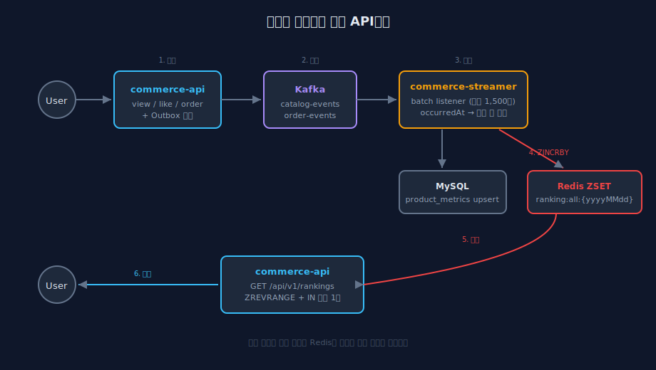
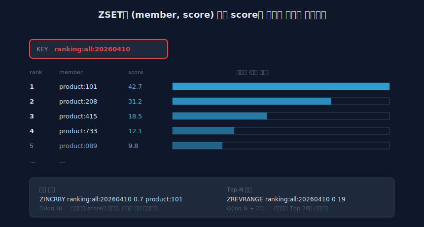
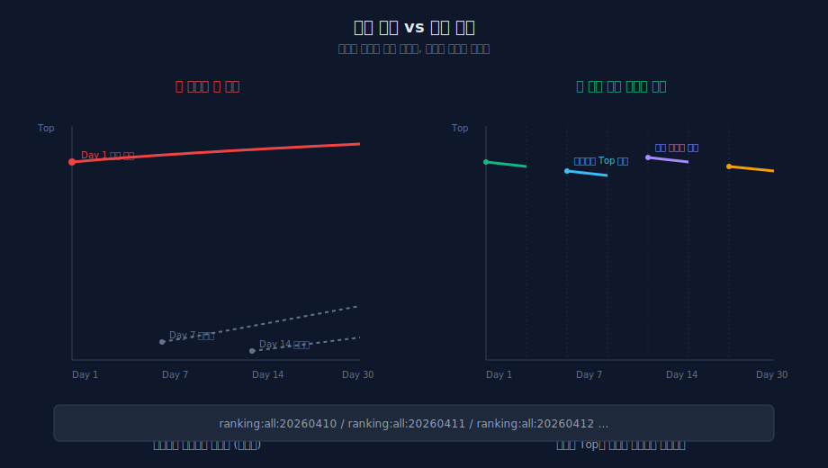
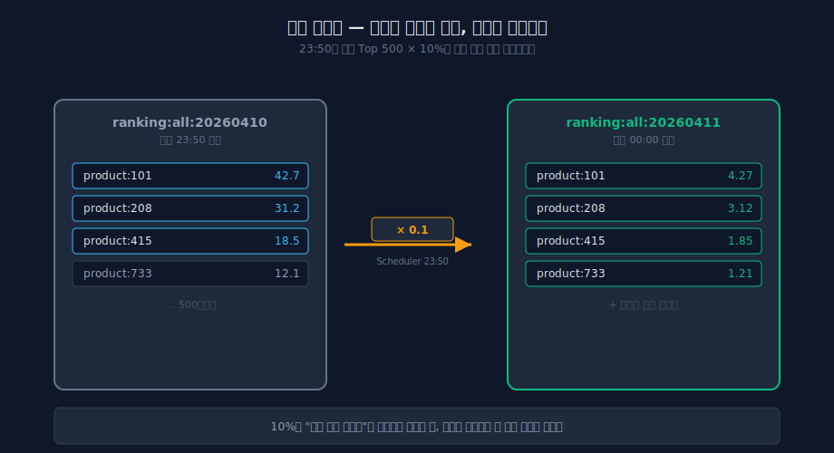

# 오늘의 인기상품, 어제의 인기상품과 어떻게 구분할까?

> **TL;DR**
>
> Kafka로 들어오는 조회/좋아요/주문 이벤트를 Redis ZSET에 누적해서 랭킹을 만들었어요.
>
> 구현 자체는 `ZINCRBY` 한 줄이지만, 그 주변에서 `ranking:all:{yyyyMMdd}` 키를 어떻게 자를지, 가중치는 왜 0.1/0.2/0.7인지, `LocalDate.now()`가 왜 큰일 날 뻔했는지, 자정에 빈 랭킹을 어떻게 메웠는지, Top 20 조회에 21번의 DB 쿼리가 나가던 N+1을 어떻게 잡았는지에 대한 기록입니다.

---

## DB `ORDER BY`로 끝낼 수 있지 않을까?

Kafka 파이프라인과 `product_metrics` 테이블은 이전 라운드에서 이미 만들어둔 상태였어요.
조회/좋아요/주문 이벤트가 들어오면 `commerce-streamer`가 소비해서 `view_count`, `like_count`, `order_count`, `sales_amount`를 누적 `UPSERT`하는 구조입니다.

처음 든 생각은 이거였어요. 이미 테이블이 있는데, 그냥 쿼리 한 방으로 끝내면 안 되나?

```sql
SELECT product_id,
       view_count * 0.1 + like_count * 0.2 + order_count * 0.7 AS score
FROM product_metrics
ORDER BY score DESC
LIMIT 20;
```

동작은 합니다. 정합성도 완벽하고 인프라도 추가로 필요 없어요.
근데 랭킹 API는 홈 메인, 카테고리별 인기 정렬, 상품 상세의 "현재 N위" 배지까지 한 화면에서만 여러 번 호출됩니다. 매번 `product_metrics`를 풀스캔해서 정렬하면 데이터가 쌓일수록 느려져요.

score 컬럼을 미리 계산해서 저장하는 방법도 있는데, 가중치 한 번 바꾸려면 전체 row를 다시 갱신해야 합니다.
마케팅에서 "이번 주는 좋아요 가중치를 올리자"고 한마디 하면 그 뒤로 배치 하나가 돌아야 한다는 뜻이에요.

결정적이었던 건 `product_metrics`가 누적 테이블이라는 점이에요.
어제의 조회수와 오늘의 조회수가 뒤섞여 있어서 "오늘의 랭킹"을 만들 방법이 없습니다.
snapshot 테이블 + 배치 복사로 어떻게든 만들 수는 있는데, 그 순간 "실시간"이라는 단어가 무색해져요.

DB는 접었습니다.

---

## Redis ZSET

Sorted Set은 `(member, score)` 쌍을 score 기준으로 정렬된 상태로 유지해요.
삽입/수정이 O(log N), Top-N 조회가 O(log N + N).

쓰는 명령은 세 개면 됩니다.

```
ZINCRBY ranking:all:20260410 0.7 product:101
ZREVRANGE ranking:all:20260410 0 19 WITHSCORES
ZREVRANK ranking:all:20260410 product:101
```

`ZINCRBY`는 원자적이에요.
Redis가 싱글 스레드로 돌아가서, 1,000건이 동시에 들어와도 race condition이 없습니다.
Round 8에서 대기열을 만들 때도 같은 이유로 `ZADD NX`를 썼는데, 이번에는 "정렬" 자체가 쓰는 목적입니다.



사용자가 상품을 조회하거나 좋아요를 누르거나 주문하면, `commerce-api`가 Outbox 패턴으로 이벤트를 DB에 먼저 저장합니다.
스케줄러가 1초마다 Outbox를 polling해서 Kafka로 발행하고, `commerce-streamer`가 배치로 소비해요.
이번 작업은 기존 `product_metrics` 누적 로직 옆에 ZSET `ZINCRBY`를 한 줄 추가하는 게 전부였습니다.



---

## `ranking:all:20260410`

과제가 준 키 포맷은 `ranking:all:{yyyyMMdd}`예요.
처음엔 그냥 날짜 붙인 문자열이라고 생각했는데, 구현하다 보니 이 키 하나에 판단이 몇 개나 들어가 있었어요.

`all`은 차원입니다.
지금은 전체 상품이지만, 카테고리별 랭킹이 붙으면 `ranking:fashion:20260410`, 브랜드별이면 `ranking:brand:1:20260410` 식으로 확장돼요.
차원이 키 이름에 박혀 있으면 네임스페이스가 자연스럽게 분리됩니다.

`{yyyyMMdd}`는 시간 윈도우.
하루 지나면 새 키가 생기고, 어제 키는 그대로 남아 있어요.
`date=20260409`로 요청하면 어제 랭킹, `date=20260410`이면 오늘.



이걸 굳이 날짜로 자르는 이유는 단순합니다.
누적으로만 점수를 쌓으면 Day 1에 올라간 히트 상품이 한 달 내내 Top에 머물러요.
신상품은 아무리 좋아도 누적 점수를 따라잡을 수 없고, 소수가 Top을 독식합니다.

일간으로 자르면 매일 0에서 시작합니다.
신상품도 오늘 하루 많이 팔리면 Top에 올라가고, 어제의 히트 상품도 오늘 반응이 없으면 내려갑니다.

TTL은 2일로 잡았어요.

```kotlin
masterRedisTemplate.expire(key, TTL_DAYS, TimeUnit.DAYS)  // TTL_DAYS = 2
```

1일이면 자정에 어제 키가 사라집니다.
자정 직후에 "어제의 인기상품"을 조회하면 빈 결과가 나와요.
2일이면 오늘 새벽 3시에도 어제 키가 살아있어서 전일 조회가 됩니다.
3일로 늘리면 메모리가 1.5배. 상품 10만 개 기준으로 ZSET 하나당 6~8MB니까 3일치는 18~24MB 정도인데, 굳이 더 쌓아둘 이유가 없었어요.

---

## 가중치는 왜 이 숫자냐

점수 계산식은 이렇게 정했어요.

```
score = 0.1 × view + 0.2 × like + 0.7 × order
```

조회에 0.1을 준 건 조회가 가장 빈번해서예요.
유저는 하루에 수십 개의 상품을 스쳐 지나갑니다.
이 가중치를 높게 잡으면 "많이 노출된 상품"이 Top을 차지해요.
광고 영역에 걸린 상품이 조회만 받고 구매는 적어도 1위가 되는 상황이 나옵니다.

좋아요에 0.2를 준 건 좋아요가 "관심은 있는데 구매는 아직"이라는 중간 시그널이라서예요.
좋아요 100개가 매출 100건을 보장하지 않아요.
조회보다는 강하고 주문보다는 약한 게 맞다고 봤습니다.

주문에 0.7을 준 건 돈을 쓴 행동이 제일 강한 시그널이기 때문이에요.
이게 랭킹의 본질적인 목적이고, 주문 1건이 좋아요 3~4건, 조회 7건 정도의 가치를 가진다고 본 셈입니다.

| 시그널 | 가중치 | 근거 |
| --- | --- | --- |
| view | 0.1 | 빈번하지만 구매 의사 약함. 노출 편향 방지 |
| like | 0.2 | 관심 표현. 구매보다 약함 |
| order | 0.7 | 실제 구매. 가장 강한 시그널 |

합을 1.0으로 맞춘 건 읽기 편해서예요.
score를 "가중 평균 행동 수"처럼 읽을 수 있고, 나중에 어디를 깎으면 어디를 올려야 하는지 감이 잡힙니다.

주문에는 수량까지 곱했어요.

```kotlin
"ORDER_COMPLETED" -> {
    for (item in items) {
        val quantity = (item["quantity"] as Number).toInt()
        rankingScoreUpdater.incrementScore(
            productId,
            RankingEventType.ORDER,
            eventDate,
            quantity.toDouble(),
        )
    }
}
```

10개 팔린 상품은 1개 팔린 상품보다 10배 가중치를 받습니다.

---

## `LocalDate.now()` 이거 큰일 날 뻔했다

`RankingScoreUpdater`를 처음엔 이렇게 썼어요.

```kotlin
fun incrementScore(productId: Long, eventType: RankingEventType, score: Double = 1.0) {
    val key = buildKey(LocalDate.now())  // ← 여기
    val delta = eventType.weight * score
    masterRedisTemplate.opsForZSet().incrementScore(key, productId.toString(), delta)
}
```

`LocalDate.now()`로 "지금" 날짜의 키를 만들고 거기에 점수를 누적하는 방식이에요.
테스트는 전부 녹색. 로컬에서는 이벤트 발생과 소비가 거의 동시에 일어나니까 당연히 돌아가는 것처럼 보입니다.

PR을 올리기 직전, diff를 다시 훑다가 이 한 줄에서 멈췄어요.

`LocalDate.now()`.

이 `now`가 가리키는 게 **소비 시점**이지 **발생 시점**이 아니구나.

Kafka 컨슈머 랙이 한 시간 쌓이면 어떻게 될까?
어제 23:30에 발생한 주문 이벤트가 오늘 00:30에 소비되면?
`LocalDate.now()`는 오늘 키를 반환합니다.
어제 매출이 오늘 Top에 꽂히고, 어제 랭킹에는 그 주문이 누락돼요.

평소에 랙이 짧을 때는 티가 안 납니다.
장애 복구 직후나 배포 직후처럼 랙이 크게 벌어지는 순간에만 증상이 드러나는데, 그때는 이미 잘못된 데이터가 ZSET에 쌓인 뒤입니다.
ZSET에서 특정 이벤트만 골라내서 빼는 건 이벤트 로그 없이는 불가능해요.

이벤트의 `occurredAt`을 파싱해서 키를 만드는 방향으로 바꿨습니다.

```kotlin
fun incrementScore(
    productId: Long,
    eventType: RankingEventType,
    eventDate: LocalDate,    // ← 호출부에서 주입
    score: Double = 1.0,
) {
    val key = buildKey(eventDate)
    val delta = eventType.weight * score
    masterRedisTemplate.opsForZSet().incrementScore(key, productId.toString(), delta)
    ensureTtl(key)
}
```

```kotlin
private fun parseEventDate(occurredAt: String?): LocalDate {
    if (occurredAt == null) return LocalDate.now()
    return try {
        ZonedDateTime.parse(occurredAt).toLocalDate()
    } catch (e: Exception) {
        LocalDate.now()
    }
}

// processRecord 내부
val eventDate = parseEventDate(generic["occurredAt"]?.toString())
rankingScoreUpdater.incrementScore(productId, RankingEventType.VIEW, eventDate)
```

한 줄만 바꾸면 되는 수정이었어요.
PR을 그대로 올렸으면 한동안 발견도 못 했을 거예요.

같은 맥락에서 `expire()`도 하나 더 잡았어요.
매 `incrementScore`마다 `expire()`를 호출하고 있었는데, 초당 수천 건의 이벤트가 들어오면 불필요한 `EXPIRE` 명령이 수천 번 나갑니다.
키별로 TTL은 한 번만 걸면 되니까, `ConcurrentHashMap`으로 "이미 TTL 설정한 키"를 추적하도록 바꿨어요.

```kotlin
private val ttlInitialized = ConcurrentHashMap<String, Boolean>()

private fun ensureTtl(key: String) {
    ttlInitialized.computeIfAbsent(key) {
        masterRedisTemplate.expire(key, TTL_DAYS, TimeUnit.DAYS)
        true
    }
}
```

키 개수가 날짜 단위라 많아야 2~3개. 맵 엔트리도 그만큼만 생깁니다.

---

## 자정에 랭킹이 비어있다

일간 키로 나누면서 새로운 문제가 생깁니다.
자정이 지나는 순간 오늘 키는 완전히 비어요.

00:00:01에 유저가 "오늘의 인기상품"을 조회하면 빈 배열이 나옵니다.
**콜드 스타트**라고 부르는데, 랭킹 시스템 설계할 때 거의 모든 사람이 한 번은 부딪치는 숙제예요.

선택지는 세 가지였어요.

빈 결과를 주고 몇 시간 기다리게 하는 방법이 있습니다.
가장 단순한데, 자정 직후 접속한 유저는 아무것도 못 봐요.
"이 서비스는 새벽에 죽나?" 싶은 인상을 남길 수 있고요.

빈 결과일 때 전날 랭킹을 그대로 내보내는 방법도 있습니다.
구현은 쉽지만 "오늘의 인기상품"이라는 타이틀과 데이터가 일치하지 않게 돼요.
오전에 본 상품을 오후에 다시 찾아가면 순위가 완전히 달라져 있습니다.

전날 점수의 일부를 오늘로 미리 복사해두는 방법이 남았어요.
**Score Carry-Over**.
어제 Top에 있던 상품들에게 작은 점수를 미리 깔아두는 겁니다.
오늘 시그널이 쌓이기 전까지는 어제 기준으로 보여주다가, 오늘 시그널이 쌓이면 자연스럽게 순위가 갱신됩니다.



세 번째로 갔어요.
매일 23:50에 스케줄러가 돌면서, 전일 Top 500의 score에 0.1을 곱해서 오늘 키에 넣어둡니다.

```kotlin
@Scheduled(cron = "0 50 23 * * *")
fun carryOverScores() {
    val today = LocalDate.now()
    val tomorrow = today.plusDays(1)
    val sourceKey = rankingScoreUpdater.buildKey(today)
    val targetKey = rankingScoreUpdater.buildKey(tomorrow)

    val topEntries = masterRedisTemplate.opsForZSet()
        .reverseRangeWithScores(sourceKey, 0, CARRY_OVER_LIMIT - 1)

    if (topEntries.isNullOrEmpty()) {
        log.info("carry-over 대상 없음. sourceKey={}", sourceKey)
        return
    }

    for (entry in topEntries) {
        val member = entry.value ?: continue
        val carryScore = (entry.score ?: 0.0) * CARRY_OVER_WEIGHT  // 0.1
        if (carryScore > 0) {
            masterRedisTemplate.opsForZSet().incrementScore(targetKey, member, carryScore)
        }
    }
    masterRedisTemplate.expire(targetKey, TTL_DAYS, TimeUnit.DAYS)
}
```

10%가 적당한 숫자냐를 한참 고민했어요.
20%로 잡아보니 어제 Top이 오늘도 Top에 계속 남아있었습니다. 롱테일 피하려고 날짜로 잘랐는데 carry-over로 롱테일이 다시 돌아오면 의미가 없어요.
5%로 낮추면 carry-over 효과가 거의 없어져서 자정 직후에도 랭킹이 사실상 빈 것처럼 보였고요.

10%는 "오늘 주문 한두 건만 와도 금방 추월당하는 수준"이에요.
어제 score 42.7이었던 상품이 오늘 4.27로 시작하는데, 오늘 주문 10건(score 7.0)만 나오면 바로 밀려납니다.

Top 500만 복사하는 것도 이유가 있어요.
어제 ZSET에 10만 개가 쌓였어도 그중 의미 있는 건 상위 몇 백 개뿐입니다.
score가 0.1밖에 안 되는 롱테일까지 다 복사하면 Redis 쓰기만 낭비예요.
500이면 유저가 실제로 보게 될 범위는 커버합니다.

📌 **ZUNIONSTORE로 하면 더 깔끔하지 않나?** — 맞아요. 한 번에 두 ZSET을 가중 합산할 수 있는 명령이 있는데, Lettuce 클라이언트에서 WEIGHTS 파라미터 지정 API가 어색하고 Top 500 제한 걸기가 번거로워서 수동 반복 복사로 갔어요.

---

## Top 20 조회에 21개 쿼리가 나가는 이유

랭킹 API를 처음 구현했을 때 UseCase는 이랬어요.

```kotlin
fun getRankingPage(date: String, page: Int, size: Int): RankingPageInfo {
    val entries = rankingRepository.getTopRankings(date, offset, size.toLong())
    // ...
    val products = entries.map { productRepository.findById(it.productId) }  // ← N+1
    // ...
}
```

ZSET에서 productId 20개 꺼낸 다음, 각각에 대해 `findById`.
코드만 보면 자연스러워요.
실제로는 Top 20 한 번 조회에 DB 쿼리가 21번 나갑니다.

트래픽이 적을 때는 드러나지 않아요.
랭킹 API가 홈 메인에서 초당 수십 번 호출되는 걸 가정하면, 50 req/s만 들어와도 DB 쿼리는 초당 1,000번입니다.
그중 20번은 매번 같은 범위의 ID를 조회하는데, DB 입장에서는 매번 별도 쿼리로 처리해야 하니까요.

`findAllByIds`를 추가했어요.

```kotlin
// ProductRepository (domain)
interface ProductRepository {
    fun findAllByIds(ids: List<Long>): List<Product>
    // ...
}

// ProductJpaRepository (infrastructure)
@Query("SELECT p FROM ProductEntity p WHERE p.id IN :ids AND p.deletedAt IS NULL")
fun findAllActiveByIds(ids: List<Long>): List<ProductEntity>

// GetRankingUseCase
val productIds = entries.map { it.productId }
val products = productRepository.findAllByIds(productIds)  // IN 쿼리 1회
val productMap = products.associateBy { requireNotNull(it.persistenceId) }

val rankings = entries.mapNotNull { entry ->
    val product = productMap[entry.productId] ?: return@mapNotNull null
    // ...
}
```

`WHERE p.id IN (:ids)` 한 방.
쿼리 수가 21에서 2로 줄었어요.

이런 N+1은 프레임워크가 안 잡아줍니다.
JPA의 `@OneToMany` fetch 전략으로 걸리는 종류가 아니라, 애플리케이션 코드에서 컬렉션을 받아 개별 조회하는 패턴에서 생기는 거라 쿼리 로그 없이는 안 보여요.

브랜드도 같은 방식으로 묶었습니다.

```kotlin
val brandIds = products.map { it.refBrandId }.toSet()
val brandMap = brandRepository.findAllByIds(brandIds)
    .associateBy { requireNotNull(it.persistenceId) }
```

랭킹 20개 조회에 나가는 DB 쿼리는 ZSET 조회 + product IN + brand IN, 총 3번.

---

## 아직 안 푼 것들

**실시간 가중치 조절.**
가중치가 `enum`에 하드코딩되어 있어요.
마케팅이 "이번 주는 좋아요를 0.3으로" 한마디 하면 코드 수정 + 배포가 필요합니다.
Redis Hash나 Config 테이블로 빼면 실시간 조절이 되는데, 그러면 이벤트마다 가중치를 조회해야 해서 오버헤드가 생기고, 캐싱하면 무효화 타이밍 문제가 따라옵니다.
일단 하드코딩으로 남겨뒀어요.

**시간 단위 랭킹.**
"지금 이 순간 인기 급상승"을 만들려면 `ranking:all:2026041014` 같은 시간 단위 키가 필요합니다.
키가 24배로 늘고 Redis 메모리도 그만큼 늘어나요.
콜드 스타트 주기도 하루 1번이 아니라 시간당 1번이 됩니다.
현재 트래픽에서는 오버 엔지니어링이라 안 넣었어요.

**Redis 장애 시 복구.**
ZSET이 Redis에만 있어서, Redis가 죽으면 그날 누적된 랭킹이 통째로 날아갑니다.
`product_metrics` 테이블에 누적 데이터는 남지만 이건 "전체 누적"이지 "오늘의 시그널"이 아니에요.
Kafka 재처리로 채우려면 consumer offset을 되돌려야 하는데, 그러면 `product_metrics`가 이중 누적돼서 정합성이 깨집니다.
"랭킹 복구를 위해 metrics 오차를 감수할 것인가"라는 트레이드오프를 풀어야 해요.

**ZSET 메모리 관리.**
상품이 100만 개가 되면 ZSET 하나당 60~80MB, 2일치면 120~160MB입니다.
감당은 가능한데, score 0.1짜리 롱테일까지 다 남겨두는 건 낭비라서 `ZREMRANGEBYRANK`로 주기적으로 꼬리를 자르는 cap 전략도 검토해볼 만해요.

---

## 끝나고 나서

PR을 올리기 직전이었어요.
diff를 다시 훑다가 `RankingScoreUpdater.incrementScore` 시그니처에 눈이 멈췄습니다.

```kotlin
val key = buildKey(LocalDate.now())
```

"이 `now`가 가리키는 게 지금인가, 이벤트가 발생한 시점인가."
이 질문 하나 던져본 게 전부였어요. 질문이 떠오른 순간 답도 같이 떠올랐습니다.
소비 시점이 아니라 발생 시점이어야 한다는 거.
컨슈머 랙이 벌어지는 순간에만 증상이 나오니까 테스트로는 평생 안 잡힐 버그였어요.

N+1도 같은 맥락이었어요.
`productIds.map { findById(it) }`는 문법적으로 자연스럽고, 테스트는 녹색, 로컬에선 빠릅니다.
"이 코드가 초당 50 req 받으면?" 이 질문을 안 하면 안 보여요.

`ranking:all:20260410`이라는 키는 처음 봤을 때 그냥 날짜 붙인 문자열이었어요.
구현이 끝나갈 즈음엔 이 키 안에 TTL, carry-over, occurredAt 파싱, 시간 윈도우 경계가 전부 걸려 있더라고요.

다음 주차는 일간을 주간/월간으로 확장하는 배치 작업이라고 합니다.
`ZUNIONSTORE`로 7개 키를 합치는 구조가 되겠지만, 거기서도 시간 단위를 어떻게 자르는지 같은 판단이 또 나올 것 같아요.
