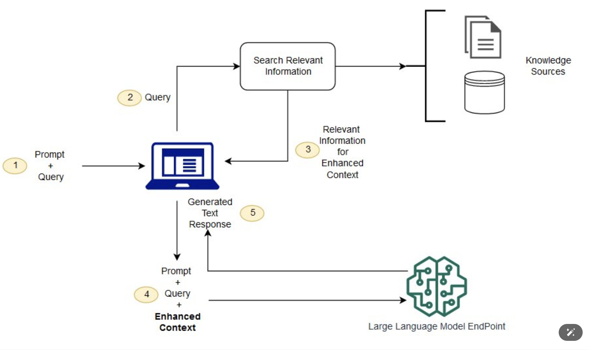

# 점점 개발자에게 요구되는 Ai 지식
2022 년을 기점으로 한참 AI 가 Boom-up이 되고 나서, 웹 개발자들의 생산성이 급격하게 올라갔어요. 심지어 ai 의 종류도 다양하고 프로젝트를 진행하면서 ai 를 잘 이용하는게 오히려 필수 스킬이 되고 회사에서 원하는 인재상 이기도 하죠.   

기술의 패러다임이 5년 주기로 바뀐다는데, AI 가 개발자 세상에 등장하고 나서 활성화 된지 어언 3년.. 이제는 AI 를 인정하고 미련을 버리기로 하였습니다.

AI 의 모든것을 공부하기엔 너무 오래 

### Spring AI 를 왜 사용할까 ?
Spring AI를 사용하면 개발자가 OpenAI의 GPT-4 및 DALL-E 3의 기능을 쉽 게 활용할 수 있으므로 Java 개발자가 복잡한 인공 지능 기능에 액세스할 수 있다  

Spring Boot와 OpenAI를 활용하여 다양한 AI 솔루션을 구축할 수 있고, AI 기본 사항을 배울 필요 없이 문서 유사성 검색, 추천 시스템, 음성-텍스트 변환과 같은 실제 애 플리케이션을 개발할수 있게 된다.

### Rag 이란 ?
RAG 은 Retrieval-Augmented Generation의 약자로, 정보 검색과 생성 AI를 결합한 기술이다.  
대규모 언어 모델(LLM)과 데이터베이스를 조합하여, 질문에 대해 더 정확하고 신뢰할 수 있는 답변을 생성하는 데 사용된다.  

( LLM과 함께 RAG를 사용하는 개념적 흐름 )

### AI 모델 이란?
- 데이터를 통해 특정 작업을 수행할 수 있도록 학습된 수학적 표현 또는 프로그램이다.
- 데이터를 분석하여 패턴을 인식하고, 이를 바탕으로 주어진 작업을 처리하는 방식을 동작한다.
- 인간이 학습하고 연습을 통해 기술을 익히듯, AI 모델도 예제를 학습하여 작업을 수행하는 "똑똑한 시스템" 으로 볼 수 있다.
> AI 도델은 데이터를 통해 학습된 문제 해결 도구이다.  
> 예를들어 이미지 분류 모델이라던가, 자연어 처리, 음성 인식등 다양한 작업에 사용될 수 있다.

### GPT 란 ?
- GPT(Generative Pre-trained Transformer) 는 OpenAI에서 개발한 언어 모델로, 자연어 처리(NLP) 작업에 사용된다.
- 사람이 텍스트를 생성하거나, 이해할 수 있도록 훈련된 모델이다.