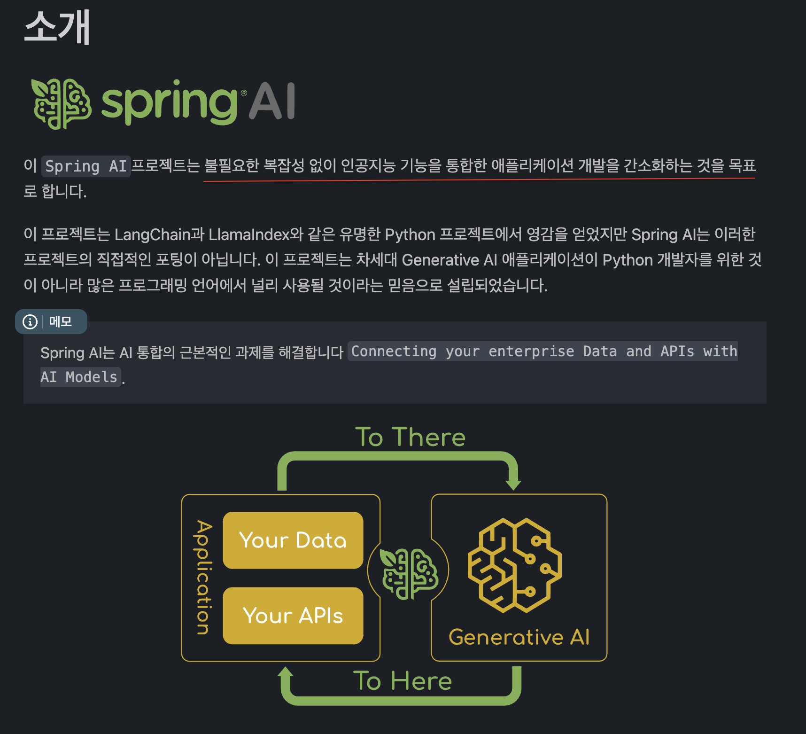

## 아이스 브레이킹

22 년 어느날, Back-end 개발자로 개발생활을 영위하며 바쁜 일상생활을 보내고 있었던 🍁가을무렵 이였다. 헤성처럼 나타나 개발자들에게 *"코더 계속 하실 ?"* 이라는 극딜을 준 G 선생. 솔직히 처음 모델만 해도 리펙토링 정도만 살짝 참고하는 정도여서 전혀 `긁`히지 않았다. 분명 그랬을 터인데, 24년 여름쯤 이였다. 일정 테트리스로 인하여 여러 프로젝트가 겹쳐 시간이 빠듯하였고 결국 생성형 AI 를 적극 활용하기로 하였다. 그 결과 무려 10배 혹은 20배나 되는 `생산성의 맛` 을 봐 버렸고. 요망한 AI 에게 의존하는 삶을 살게 되었다.

의존 하다보니 느끼는 감정은 날것 그대로 쓰기엔 오류도 많고 아직 사람손이 타야하는 영역이 많긴한데, 점점 그 빈도가 **줄어들고 있다는 점**에서 불안과 걱정의 씨앗이 심어졌다. 정말 어느 순간 모르게 급격하게 발전해서 **"비즈니스 영역까지 커버하게 된다면"** 더이상 내 자신이 회사에 필요하지 않게될 날이 도래하겠다는 생각이 들었다. "에이 ~ AI 는 아직 부족한 부분이 많으니 대체되지 않을거야" 라는 **미련을 빨리 버려야 된다**고 생각했다. 그러나 처음부터 AI 의 모든 영역을 공부하기엔 현실적으로 많은 러닝커브가 따르고 막막하여 생각에 잠긴다.

> 1️⃣ Web 개발자 관점에서 AI 를 활용하기 위해 어떤 개념들을 알아야 할까 🤔 ?  
> 2️⃣ Spring AI 가 있다는데, python 없이도 AI 기술들을 커버할 수 있는걸까 🤔 ?  
> 3️⃣ 많이 뒤쳐진것 같아 불안해. 빠르게 AI 기술들을 적용해보고 싶어 ‼️  

## 돈워리. Web 개발자 관점에서 요구되는 AI 기술 부터
웹 개발자는 AI 모델을 직접 연구하거나 신경망을 설계하는 사람이 아니다. **AI를 활용하여 제품을 개발하고 사용자 경험을 향상시키는 데 초점**을 맞추어야 한다. 단, 요구되는 지식은 다음과 같다.

- **AI 기술 이해**: ( 머신러닝 딥러닝 기본 개념 ), AI 모델 작동 방식
- **API 및 라이브러리 활용**: openAi API 과 같은 도구를 사용하여 애플리케이션에 AI 기능 통합
- **멀티모달 데이터 처리**: 텍스트, 이미지, 음성 등 다양한 데이터를 처리하여 사용자 경험 개선
- **데이터 기반 의사결정**: 사용자 데이터를 분석하고 이를 기반으로 제품 설계 및 최적화.

> 기술의 발전과 패러다임을 보면 항상 사용자에게 시간을 준다. 딱 5년. 2년도 안남았네 ..  
> 🏃🏿 지금부터 SpringAI 를 기점으로 AI 와 빠르게 친해지는 길로 달려보는 수 밖에.

## Spring AI란 무엇인가?

Spring AI는 Java 개발자를 위한 AI 통합 프레임워크다. 기존에 AI 기능을 추가하려면 Python, 머신 러닝, 딥 러닝에 대한 광범위한 지식이 필요했는데 Spring AI를 사용하면 개발자가 OpenAI의 GPT-4 및 DALL-E 3의 기능을 쉽 게 활용할 수 있어, Java 개발자가 복잡한 인공 지능 기능에 액세스 할 수 있게 되었다. Spring 기술과 자연스럽게 연결되기 때문에 AI 기술을 `처음부터` 배우지 않아도 된다.

## 왜 Spring AI로 시작해야 할까?

Spring AI는 복잡한 AI 기술을 Java 개발자가 쉽게 접근할 수 있도록 단순화 되어있다. 굳이 채택하려는 이유라고 하면 다음과 같다.
- **효율성**: 기존 Spring 생태계를 활용해 빠르게 시작 가능.
- **확장성**: 다양한 모델과 데이터베이스를 유연하게 교체 및 확장 가능.
- **생산성 향상**: 반복 작업을 자동화하고, 개발자가 중요한 문제 해결에 집중할 수 있도록 도움.

## Spring AI로 무엇을 만들 수 있을까?

Spring AI를 활용하면 다음과 같은 애플리케이션을 개발할 수 있다.
- RAG 기반 검색 시스템: 질문에 대해 정확한 답변을 제공하는 검색 엔진.
- 대화형 챗봇: OpenAI GPT-4와 연동된 스마트 대화 시스템.
- 이미지 분석 및 생성: 멀티모달 기능을 활용한 이미지 처리 애플리케이션.

> Toy Project 딱대 🥰  마지막으로 Spring AI 의 주요 기능과 설명으로 이번 포스팅을 마치며,   대화형 chat api 를 open ai 를 활용하여 toy project 를 다루는 방향으로 2 편을 작성해보려고 한다.

## 주요 기능 과 설명
| 기능                              | 설명                                                                 | 장점                                                                                       |
|--------------------------------------|-----------------------------------------------------------------------------|--------------------------------------------------------------------------------------------------|
| Boot Auto Configuration Support      | Spring Boot와의 통합으로 AI 기능을 쉽게 설정할 수 있다.                     | 복잡한 설정 코드를 줄여 개발 속도를 높인다.                                                            |
| Multiple AI Support                  | OpenAI, Hugging Face, Google BERT 등 여러 AI 모델을 쉽게 사용할 수 있다.    | 다양한 AI 모델 간의 비교와 최적화를 쉽게 수행할 수 있으며, 모델 변경 시 코드 수정이 최소화된다.                        |
| ChatClient API                       | AI와 대화하는 기능을 쉽게 구현할 수 있다.                                  | 대화형 AI 애플리케이션을 쉽게 구축할 수 있으며, 사용자와의 상호작용을 원활하게 처리한다.                             |
| Prompt Template                      | 프롬프트 템플릿을 통해 AI에 보낼 입력값을 쉽게 조정할 수 있다.               | 코드의 재사용성을 높이고, 다양한 요구 사항에 맞는 질의를 손쉽게 작성할 수 있다.                                    |
| Vector Embedding and Search          | 문서를 벡터화하고, 벡터 검색을 통해 고성능 검색 엔진을 구현할 수 있다.       | 복잡한 데이터를 효율적으로 검색하고 분석할 수 있으며, 이는 정보 검색 및 추천 시스템에 유용하다.                        |
| Advisors API                         | 반복적인 생성 AI 패턴을 캡슐화하고, 데이터를 변환하여 다양한 모델과 사용 사례에 걸쳐 이식성을 제공한다. | AI 애플리케이션의 구조적 설계를 간소화하고, 성능을 최적화하며, 변화하는 요구사항에 빠르게 적응할 수 있다.              |
| Retrieval Augmented Generation (RAG) | 정보 검색과 생성 AI를 결합하여 더 정확하고 신뢰할 수 있는 콘텐츠를 생성하는 기술을 지원한다. | 대규모 언어 모델의 한계를 보완하여 질문에 대한 더 정확한 답변을 제공한다.                                        |
| Observability and Model Evaluation   | AI 관련 작업에 대한 통찰력을 제공하고, 생성된 콘텐츠의 품질을 평가하는 도구를 지원한다. | AI 모델의 성능을 모니터링하고, 잘못된 응답을 방지하여 시스템의 신뢰성을 높인다.                                        |

---
